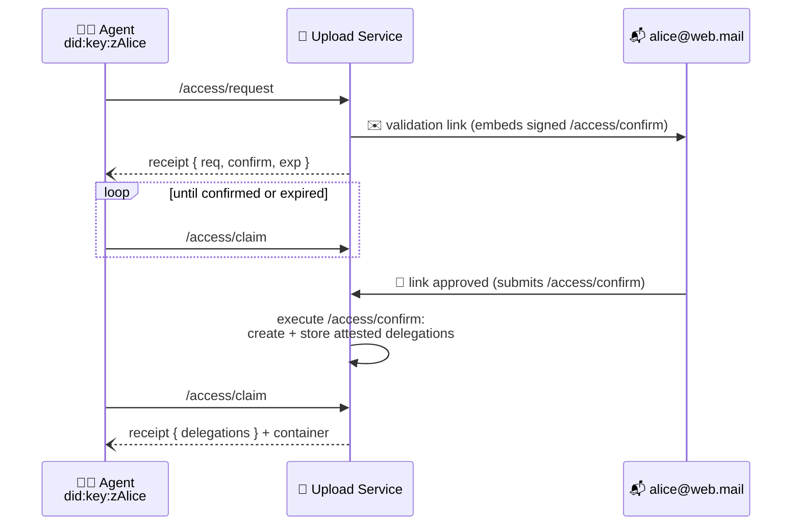

# Access Protocol


## Authors

- [Irakli Gozalishvili](https://github.com/Gozala)

## Editors

- [Alan Shaw](https://github.com/alanshaw)

## Abstract

The access protocol governs how agents gain authorization. It defines how an agent requests capabilities from an [account] — verified through a familiar email flow — and how authorized delegations are delivered to their audience, with the upload service acting as the delivery channel.

## Language

The key words "MUST", "MUST NOT", "REQUIRED", "SHALL", "SHALL NOT", "SHOULD", "SHOULD NOT", "RECOMMENDED", "MAY", and "OPTIONAL" in this document are to be interpreted as described in [RFC2119](https://datatracker.ietf.org/doc/html/rfc2119).

# Introduction

[Space] access is represented as a signed authorization in [UCAN] format. It is not enough to issue a [UCAN] delegation — the issuer needs some channel to deliver it to its audience. In this protocol the upload service acts as that channel: a sender stores delegations with the service, and a recipient claims delegations stored for them.

Accounts introduce a second problem: an [account] is identified by a [`did:mailto`][did:mailto] identifier, which has no key material and cannot sign delegations directly. This protocol defines the email verification flow through which the upload service — acting as the trusted [authority][attested authority] — creates delegations on an account's behalf, signed with the [attested authority] signature scheme.

## Intuition

### Shared Space

Alice has set up a space for sharing photos with her family and friends. She wants to authorize her partner Bob with write access so he can also upload photos. She wants to authorize her less tech savvy parent Mallory with just read access so she can look at photos but not add or delete them.

> In this scenario Alice delegates the `/upload/add` capability to Bob and the `/upload/list` capability to Mallory. The application used by Alice leverages the access protocol to send the issued delegations to Bob and Mallory. Applications used by Bob and Mallory leverage the access protocol to receive delegations sent to them, transparently gaining access to the space that Alice has shared.

### Multi-device Access

Alice has created a new space for storing photos on her laptop and uploaded some photos. Later she picks up her phone and logs in with her account to upload some photos to her space.

> In this scenario after the space is created the access protocol is used to delegate full authority over the space to Alice's [account]. Later, when Alice logs in on her phone, her agent requests authorization from the account, and receives the account's delegated capabilities over the access protocol — thereby gaining access to the space.

## Concepts

### Roles

| Name           | Description                                                                                                    |
| -------------- | ----------------------------------------------------------------------------------------------------------------- |
| Principal      | The general class of entities that interact with a UCAN. Identified by a DID that can be used in the `iss`, `aud` or `sub` field of a UCAN. |
| Account        | A [principal] identified by a memorable identifier, such as [`did:mailto`][did:mailto].                        |
| Agent          | A [principal] identified by a [`did:key`] identifier, representing a user in some application installation.    |
| Upload Service | A service [principal] that verifies account control, creates attested delegations and acts as the delivery channel for delegations. |

### Account

An _account_ is a [principal] identified by a memorable identifier, such as [`did:mailto`][did:mailto]. Accounts can be used to conveniently aggregate and manage capabilities across different user [agent]s. In addition, accounts facilitate familiar user authorization and recovery flows.

An account has no key material of its own — UCANs issued by an account are signed by the upload service using the [attested authority] signature scheme, after the account holder has demonstrated control of the email address.

### Agent

An _agent_ is a [principal] identified by a [`did:key`] identifier. When interacting with the system, users may use different agents across multiple devices and applications. It is strongly advised that agents use non-extractable keys whenever possible.

> ℹ️ Note that agents are designed to be temporary and can be disposed of or created as needed.

### Space

A namespace, often referred as a "space", is an owned resource that can be shared. It corresponds to a unique asymmetric cryptographic keypair and is identified by a [`did:key`] URI.

### Common Types

Schemas in this document are described using [IPLD Schema] notation, accompanied by equivalent Go types whose `cborgen` tags define the wire keys. DIDs and commands are encoded as strings. Failure values follow the `{name, message}` convention of the [receipt] spec. The following types are shared by several capabilities:

```ipldsch
# A capability an agent wishes to be granted.
type CapabilityRequest struct {
  cmd String # the requested command
}

# A promise resolving to the success branch of another task's result,
# encoded as a single entry map keyed by "await/ok".
type AwaitOK struct {
  task Link (rename "await/ok") # task whose result resolves this promise
}

# Convention for failure values, see the receipt spec.
type Error struct {
  name    String # machine readable error name
  message String # human readable description
}
```

<details>
<summary>Go syntax</summary>

```go
type CapabilityRequest struct {
	Command ucan.Command `cborgen:"cmd"`
}

// AwaitOK marshals as {"await/ok": Task}.
type AwaitOK struct {
	Task cid.Cid
}

type Error struct {
	Name    string `cborgen:"name"`
	Message string `cborgen:"message"`
}
```

</details>

## Authorization Flow

The following diagram depicts an agent gaining authorization from an account:



1. The agent invokes [Request Access], naming the account and the capabilities it wishes to be granted.
2. The upload service creates — but does not execute — a signed [Confirm Access] invocation, embeds it in a validation link, and emails the link to the account's address.
3. When the account holder approves the link, the [Confirm Access] invocation is submitted back to the upload service and executed: delegations from the account to the agent are created — signed with the [attested authority] scheme — and stored.
4. The agent, polling [Claim Access], receives the delegations, correlating them to its request via the `accessRequest` metadata key.

# Capabilities

## Request Access

An agent MAY invoke the `/access/request` capability to request a set of capabilities from an [account]. The subject of the invocation is the agent: delegations created as a result of the request are addressed to the invocation subject.

### Request Access Invocation

#### Request Access Arguments Schema

```ipldsch
type RequestArguments struct {
  iss String              # DID of the account authorization is requested from
  att [CapabilityRequest] # capabilities the agent wishes to be granted
}
```

<details>
<summary>Go syntax</summary>

```go
type RequestArguments struct {
	Issuer       did.DID             `cborgen:"iss"`
	Attenuations []CapabilityRequest `cborgen:"att"`
}
```

</details>

The `args.iss` field MUST be set to the [account] DID from which authorization is being requested. It MUST be a valid [`did:mailto`][did:mailto] identifier.

The `args.att` field MUST be set to the list of capabilities the agent wishes to be granted. Requesting `{"cmd": "/"}` is equivalent to requesting complete authority over the account and should be reserved for special cases, as it represents a request for superuser permissions. In general, it is RECOMMENDED that agents only request the set of capabilities that are necessary to complete a user-initiated action, and only when the user initiates such an action.

#### Request Access Invocation Example

> ℹ️ Note: examples show the token payload; the enclosing signed envelope is elided. We use `// "/": "bafy.."` comments to denote the [task][UCAN task] link of an invocation, except where noted otherwise.

```jsonc
{ // "/": "bafy..request"
  "iss": "did:key:zAlice",
  "aud": "did:web:upload.example.com",
  "sub": "did:key:zAlice",
  "cmd": "/access/request",
  "args": {
    // account authorization is requested from
    "iss": "did:mailto:web.mail:alice",
    // capabilities the agent wishes to be granted
    "att": [{ "cmd": "/" }]
  },
  "prf": [],
  "nonce": { "/": { "bytes": "cmVxdWVzdA" } },
  "exp": 1735689600
}
```

### Request Access Receipt

Invocation MUST fail if `args.iss` is not a valid [`did:mailto`][did:mailto] identifier _(error name `InvalidAuthorizationAccount`)_.

Executing the invocation, the upload service MUST create a [Confirm Access] invocation and send it to the email address encoded in the account DID, as described in [Confirm Access].

The success value MUST include:

- `req` — the [task][UCAN task] link of this request. Delegations created as a result of the request carry this link in their `accessRequest` metadata, allowing the agent to correlate claimed delegations to the request.
- `confirm` — an [await][promise] on the result of the [Confirm Access] task.
- `exp` — the Unix timestamp (in seconds precision) at which the confirmation link expires. The agent SHOULD stop polling for the result after this time.

#### Request Access Receipt Schema

```ipldsch
type RequestResult union {
  | RequestOK "ok"
  | Error     "error"
} representation keyed

type RequestOK struct {
  req     Link    # link to the access request task
  confirm AwaitOK # promise of the /access/confirm task result
  exp     Int     # Unix timestamp (seconds) at which the confirmation expires
}
```

<details>
<summary>Go syntax</summary>

```go
type RequestOK struct {
	Request    cid.Cid `cborgen:"req"`
	Confirm    AwaitOK `cborgen:"confirm"`
	Expiration int64   `cborgen:"exp"`
}
```

</details>

#### Request Access Receipt Example

```jsonc
{
  "iss": "did:web:upload.example.com",
  "aud": "did:web:upload.example.com",
  "sub": "did:web:upload.example.com",
  "cmd": "/ucan/assert/receipt",
  "args": {
    // the /access/request task this receipt is for
    "ran": { "/": "bafy..request" },
    "out": {
      "ok": {
        // link to this access request
        "req": { "/": "bafy..request" },
        // promise of the confirmation result
        "confirm": { "await/ok": { "/": "bafy..confirm" } },
        // when the confirmation link expires
        "exp": 1735690500
      }
    }
  },
  "iat": 1735689600
}
```

## Confirm Access

The `/access/confirm` invocation is created in response to an access request. It is created and signed by the upload service, but _not_ executed. It is embedded in a validation link and sent via email to the account holder. Approving the link in the email submits the invocation back to the upload service for execution.

The issuer, audience and subject of the invocation are all the upload service. Since only the holder of the service's private key can issue such an invocation, its presentation back to the service proves the holder of the email inbox — and nobody else — approved the request.

### Confirm Access Invocation

The invocation MUST expire: it is RECOMMENDED that it is valid for no more than 15 minutes, to reduce the attack surface where an attacker could attempt concurrent authorization requests in an effort to confuse a user into approving the wrong link.

The metadata (`meta`) of the [Request Access] invocation MUST be copied into the confirm invocation, allowing the requester to pass information to confirmation-time processing (for example, a redirect destination to return the user to after confirmation).

The details of the validation link and approval page are an implementation concern of the service — see the [attested authority email loop][attested authority] for requirements. The link MUST NOT trigger execution on a simple HTTP `GET`, so that email link scanners cannot approve requests: implementations SHOULD render an approval page whose explicit submission executes the invocation.

#### Confirm Access Arguments Schema

```ipldsch
type ConfirmArguments struct {
  cause Link                # /access/request task that caused this confirmation
  iss   String              # DID of the account granting authorization
  aud   String              # DID of the agent being granted authorization
  att   [CapabilityRequest] # capabilities to be granted
}
```

<details>
<summary>Go syntax</summary>

```go
type ConfirmArguments struct {
	Cause        cid.Cid             `cborgen:"cause"`
	Issuer       did.DID             `cborgen:"iss"`
	Audience     did.DID             `cborgen:"aud"`
	Attenuations []CapabilityRequest `cborgen:"att"`
}
```

</details>

The `args.cause` field MUST be set to the [task][UCAN task] link of the [Request Access] task, so that the confirmation cannot be used to authorize a different request.

The `args.iss` and `args.att` fields MUST be copied from the [Request Access] arguments. The `args.aud` field MUST be set to the subject of the [Request Access] invocation — the agent the created delegations will be addressed to.

#### Confirm Access Invocation Example

```jsonc
{ // "/": "bafy..confirm"
  "iss": "did:web:upload.example.com",
  "aud": "did:web:upload.example.com",
  "sub": "did:web:upload.example.com",
  "cmd": "/access/confirm",
  "args": {
    // the /access/request task that caused this confirmation
    "cause": { "/": "bafy..request" },
    // account granting authorization
    "iss": "did:mailto:web.mail:alice",
    // agent being granted authorization
    "aud": "did:key:zAlice",
    // capabilities to be granted
    "att": [{ "cmd": "/" }]
  },
  "prf": [],
  "nonce": { "/": { "bytes": "Y29uZmlybQ" } },
  // 15 minutes after the request
  "exp": 1735690500
}
```

### Confirm Access Receipt

Invocation MUST fail if the subject is not the upload service itself _(error name `InvalidAccessConfirmSubject`)_. Invocation MUST fail if `args.iss` is not a valid [`did:mailto`][did:mailto] identifier _(error name `InvalidAccessConfirmIssuer`)_.

Executing the invocation, the upload service MUST create the following delegations, issued by the [account] and signed using the [attested authority] signature scheme with the service as the authority:

1. An **account delegation**: subject = the account, command = `/`, audience = the agent. This explicitly grants the agent the ability to operate as the account — including claiming delegations whose audience is the account, and provisioning spaces owned by the account.
2. One **delegation per requested capability**: subject = `null` _(a [powerline][UCAN delegation] — applying to all subjects, including spaces created in the future)_, command = the requested command, audience = the agent.

The created delegations SHOULD NOT expire — the account holder consented to the request. Each created delegation's `meta` MUST include an `accessRequest` field linking the [Request Access] task and an `accessConfirm` field linking the [Confirm Access] task.

The service MUST store the created delegations, indexed by audience, so that they can subsequently be retrieved with [Claim Access].

The success value MUST list the links of the created delegations, and the delegations themselves MUST be transmitted in the [container][UCAN container] alongside the receipt.

#### Confirm Access Receipt Schema

```ipldsch
type ConfirmResult union {
  | ConfirmOK "ok"
  | Error     "error"
} representation keyed

# ConfirmOK mirrors ClaimOK — confirming an access request grants the same
# shape of delegations bundle as claiming them.
type ConfirmOK struct {
  delegations [Link] # delegations granted for the request
}
```

<details>
<summary>Go syntax</summary>

```go
type ConfirmOK = ClaimOK

type ClaimOK struct {
	Delegations []cid.Cid `cborgen:"delegations"`
}
```

</details>

#### Created Delegation Examples

The account delegation _(the `// "/":` comment denotes the delegation link)_:

```jsonc
{ // "/": "bafy..accountDlg"
  "iss": "did:mailto:web.mail:alice",
  "aud": "did:key:zAlice",
  "sub": "did:mailto:web.mail:alice",
  "cmd": "/",
  "pol": [],
  "meta": {
    "accessRequest": { "/": "bafy..request" },
    "accessConfirm": { "/": "bafy..confirm" }
  },
  "nonce": { "/": { "bytes": "ZGxnMQ" } },
  // does not expire
  "exp": null
}
```

A delegation for a requested capability _(powerline — `sub` is `null`)_:

```jsonc
{ // "/": "bafy..powerlineDlg"
  "iss": "did:mailto:web.mail:alice",
  "aud": "did:key:zAlice",
  "sub": null,
  "cmd": "/",
  "pol": [],
  "meta": {
    "accessRequest": { "/": "bafy..request" },
    "accessConfirm": { "/": "bafy..confirm" }
  },
  "nonce": { "/": { "bytes": "ZGxnMg" } },
  // does not expire
  "exp": null
}
```

> ⚠️ Both delegations are issued by a [`did:mailto`][did:mailto] principal: their envelope signatures are [attested authority] signature invocations signed by the upload service, not conventional key signatures.

## Claim Access

An agent MAY invoke the `/access/claim` capability to retrieve delegations stored via [Delegate Access] or [Confirm Access] whose _audience_ matches the invocation subject.

The subject of the invocation is the [principal] whose stored delegations are being claimed. An agent claims delegations addressed to itself with a self-issued invocation. An agent MAY claim delegations addressed to an [account] by providing a proof chain from the account — which the account delegation created by [Confirm Access] provides.

After [Request Access], the agent SHOULD poll `/access/claim` until it receives delegations whose `accessRequest` metadata links the request task, or until the confirmation expiry (`RequestOK.exp`) passes.

### Claim Access Invocation

Arguments are an empty object.

```ipldsch
type ClaimArguments struct {}
```

<details>
<summary>Go syntax</summary>

```go
type ClaimArguments = commands.Unit
```

</details>

#### Claim Access Invocation Example

```jsonc
{ // "/": "bafy..claim"
  "iss": "did:key:zAlice",
  "aud": "did:web:upload.example.com",
  "sub": "did:mailto:web.mail:alice",
  "cmd": "/access/claim",
  "args": {},
  "prf": [{ "/": "bafy..accountDlg" }],
  "nonce": { "/": { "bytes": "Y2xhaW0" } },
  "exp": 1735689600
}
```

### Claim Access Receipt

The success value MUST list the links of all stored delegations whose audience matches the invocation subject. The delegations themselves MUST be transmitted in the [container][UCAN container] alongside the receipt.

#### Claim Access Receipt Schema

```ipldsch
type ClaimResult union {
  | ClaimOK "ok"
  | Error   "error"
} representation keyed

type ClaimOK struct {
  delegations [Link] # delegations stored for the subject
}
```

<details>
<summary>Go syntax</summary>

```go
type ClaimOK struct {
	Delegations []cid.Cid `cborgen:"delegations"`
}
```

</details>

#### Claim Access Receipt Example

```jsonc
{
  "iss": "did:web:upload.example.com",
  "aud": "did:web:upload.example.com",
  "sub": "did:web:upload.example.com",
  "cmd": "/ucan/assert/receipt",
  "args": {
    // the /access/claim task this receipt is for
    "ran": { "/": "bafy..claim" },
    "out": {
      "ok": {
        // links to the delegations, transmitted in the response container
        "delegations": [
          { "/": "bafy..spaceDlg" }
        ]
      }
    }
  },
  "iat": 1735689600
}
```

## Delegate Access

An agent MAY invoke the `/access/delegate` capability on the [space] subject to send a set of delegations to the upload service, for later retrieval by their respective audiences via [Claim Access].

Using the space as the subject allows the service to verify a paid account is set up, so that it is not storing delegations for arbitrary audiences.

Please note that all of the following DIDs could be different from one another: the issuer of the linked delegations, the issuer of the invocation, and the space where the delegations will be stored. In other words, a delegation MAY be sent by anyone — it does not have to be the issuer of the delegation — and a sent delegation MAY delegate capability to a subject different from the space under which it is stored.

### Delegate Access Invocation

#### Delegate Access Arguments Schema

```ipldsch
type DelegateArguments struct {
  delegations [Link] # the delegations to store
}
```

<details>
<summary>Go syntax</summary>

```go
type DelegateArguments struct {
	Delegations []cid.Cid `cborgen:"delegations"`
}
```

</details>

The `args.delegations` field MUST be set to the list of links of the delegations to store. The linked delegations MUST be transmitted in the request [container][UCAN container].

#### Delegate Access Invocation Example

```jsonc
{ // "/": "bafy..delegate"
  "iss": "did:key:zAlice",
  "aud": "did:web:upload.example.com",
  "sub": "did:key:zAliceSpace",
  "cmd": "/access/delegate",
  "args": {
    // links to the delegations, transmitted in the request container
    "delegations": [
      { "/": "bafy..spaceDlg" }
    ]
  },
  "prf": [{ "/": "bafy..dlgAliceSpace" }],
  "nonce": { "/": { "bytes": "ZGVsZWdhdGU" } },
  "exp": 1735689600
}
```

### Delegate Access Receipt

Invocation MUST fail if any of the following is true:

1. The subject space is not provisioned with a provider _(error name `InsufficientStorage`)_.
1. A delegation linked from `args.delegations` is not present in the request [container][UCAN container] _(error name `DelegationNotFound`)_.

Invocation MUST succeed otherwise, and the service MUST store the delegations, indexed by audience, for later retrieval with [Claim Access]. The success value is an empty object.

#### Delegate Access Receipt Schema

```ipldsch
type DelegateResult union {
  | DelegateOK "ok"
  | Error      "error"
} representation keyed

type DelegateOK struct {}
```

<details>
<summary>Go syntax</summary>

```go
type DelegateOK = commands.Unit
```

</details>

# Usage Patterns

## Space Recovery

After creating a space, an agent delegates full authority over the space to the user's [account] and sends the delegation to the upload service with [Delegate Access]:

```jsonc
{ // "/": "bafy..spaceDlg"
  "iss": "did:key:zAliceSpace",
  "aud": "did:mailto:web.mail:alice",
  "sub": "did:key:zAliceSpace",
  "cmd": "/",
  "pol": [],
  "nonce": { "/": { "bytes": "cmVjb3Zlcnk" } },
  "exp": null
}
```

Whenever the user authorizes an agent on any device, the agent uses the account delegation obtained from [Confirm Access] to invoke [Claim Access] with the account as subject, receiving the space delegation — and thereby access to the space.

## Sharing Access With a Friend

Alice wants to share access to her [space] with her friend Bob. She does not know whether Bob has ever used the service, but she knows his email address, allowing her to delegate capabilities to his account:

```jsonc
{ // "/": "bafy..bobDlg"
  "iss": "did:key:zAliceSpace",
  "aud": "did:mailto:gmail.com:bob",
  "sub": "did:key:zAliceSpace",
  "cmd": "/upload/list",
  "pol": [],
  "nonce": { "/": { "bytes": "Ym9i" } },
  "exp": 1767225600
}
```

She sends the delegation with [Delegate Access] so it can be claimed by Bob. When Bob authorizes an agent as `bob@gmail.com` for the first time, his agent invokes [Claim Access] with his account as subject and collects all capabilities available to the account — including the one sent by Alice — gaining access to her space.

[UCAN]:https://github.com/ucan-wg/spec
[UCAN delegation]:https://github.com/ucan-wg/delegation
[UCAN task]:https://github.com/ucan-wg/invocation#task
[UCAN container]:https://github.com/ucan-wg/container
[promise]:https://github.com/ucan-wg/promise
[principal]:https://github.com/ucan-wg/spec#principals
[`did:key`]:https://w3c-ccg.github.io/did-key-spec/
[did:mailto]:./did-mailto.md
[attested authority]:./attestation.md
[receipt]:./ucan.md#receipt
[space]:./blob.md#space
[account]:#account
[agent]:#agent
[Request Access]:#request-access
[Confirm Access]:#confirm-access
[Claim Access]:#claim-access
[Delegate Access]:#delegate-access
[IPLD Schema]:https://ipld.io/docs/schemas/
