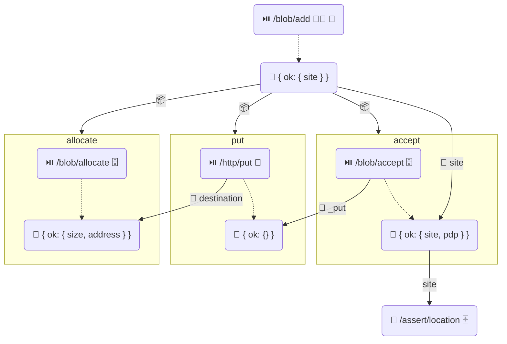

# Blob Protocol


## Authors

- [Irakli Gozalishvili](https://github.com/gozala)
- [Vasco Santos](https://github.com/vasco-santos)

## Editors

- [Alan Shaw](https://github.com/alanshaw)

## Abstract

The blob protocol allows authorized agents to store arbitrary content blobs with a storage node.

## Language

The key words "MUST", "MUST NOT", "REQUIRED", "SHALL", "SHALL NOT", "SHOULD", "SHOULD NOT", "RECOMMENDED", "MAY", and "OPTIONAL" in this document are to be interpreted as described in [RFC2119](https://datatracker.ietf.org/doc/html/rfc2119).

# Introduction

The blob protocol provides the core building block for storing content and sharing access to it through the [UCAN] authorization system

## Concepts

### Roles

There are several distinct roles that [principal]s may assume in this specification:

| Name         | Description                                                                                                                              |
| ------------ | ---------------------------------------------------------------------------------------------------------------------------------------- |
| Principal    | The general class of entities that interact with a UCAN. Identified by a DID that can be used in the `iss`, `aud` or `sub` field of a UCAN. |
| Agent        | A [Principal] identified by [`did:key`] identifier, representing a user in an application.                                               |
| Issuer       | A [principal] issuing a UCAN. It is the signer of the [UCAN]. Specified in the `iss` field.                                              |
| Audience     | Principal a UCAN is addressed to. Specified in the `aud` field.                                                                          |
| Subject      | Principal whose authority a UCAN concerns. Every proof chain is rooted in a delegation issued by the subject. Specified in the `sub` field. |
| Executor     | Principal that carries out an invocation and issues a [receipt] for it.                                                                  |
| Upload Service | A service [principal] that coordinates the blob storage protocol between agents and storage nodes.                                     |
| Storage Node | A [principal] that stores blob content and issues [location commitment]s for it.                                                        |

### Space

A namespace, often referred as a "space", is an owned resource that can be shared. It corresponds to a unique asymmetric cryptographic keypair and is identified by a [`did:key`] URI. A space is the [subject] of every capability a user exercises in this protocol.

### Blob

A blob is a fixed size byte array addressed by the [multihash]. Usually blobs are used to represent set of IPLD blocks at different byte ranges.

### Blob Lifecycle

Within a space, a blob is in one of two states:

- **Allocated** — storage reserved but the blob not yet committed: after [Allocate Blob] and before [Accept Blob]. Content may have been uploaded via HTTP `PUT` without having been accepted yet. An allocated blob is abandoned with [Abort Blob], and the allocation expires if the blob is never accepted.
- **Accepted** — content delivered, verified and registered to the space: after [Accept Blob]. An accepted blob is removed with [Remove Blob].

Storage nodes track allocations and acceptances per `(digest, space)` pair. Removal releases only a single space's claim — the blob bytes are physically deleted only once no space holds any claim on the digest, allowing safe content-addressed deduplication across spaces.

### UCAN Primitives

This specification builds on the [UCAN] suite of specifications, in particular:

- [Delegation][UCAN delegation] — an issuer grants (attenuated) authority over a subject to an audience. Delegations do not carry a chain of authority; the chain is supplied as proofs (`prf`) when a delegated capability is invoked.
- [Invocation][UCAN invocation] — an issuer instructs an executor to perform a [command] (`cmd`) on a subject (`sub`) with arguments (`args`), providing proofs (`prf`) of their authority.
- [Task][UCAN task] — the portion of an invocation identifying the work to perform: `{sub, cmd, args, nonce}`. The task link (its CID) is the stable identifier that [receipt]s and [promise]s refer to.
- [Receipt][receipt] — a signed attestation from the executor describing the result of a task. See the [UCAN extensions spec][receipt] for the wire format.
- [Promise][UCAN promise] — a placeholder value in the arguments or result of a task that resolves to the result of another task, expressed as `{"await/ok": <task link>}`.
- [Container][UCAN container] — the transport envelope: a bundle of invocations, delegations and receipts transmitted together in a request or response.

### Common Types

Schemas in this document are described using [IPLD Schema] notation, accompanied by equivalent Go types whose `cborgen` tags define the wire keys. DIDs are encoded as strings and multihashes as raw bytes. The following types are shared by several capabilities:

```ipldsch
# A promise resolving to the success branch of another task's result,
# encoded as a single entry map keyed by "await/ok".
type AwaitOK struct {
  task Link (rename "await/ok") # task whose result resolves this promise
}

# Convention for failure values, see the receipt spec.
type Error struct {
  name    String # machine readable error name
  message String # human readable description
}
```

<details>
<summary>Go syntax</summary>

```go
// AwaitOK marshals as {"await/ok": Task}.
type AwaitOK struct {
	Task cid.Cid
}

type Error struct {
	Name    string `cborgen:"name"`
	Message string `cborgen:"message"`
}
```

</details>

# Capabilities

## Add Blob

An authorized agent MAY invoke the `/blob/add` capability on the [space] subject to store a specific byte array.

> Note that storing a blob does not imply advertising it on the network or making it publicly available.

### Add Blob Diagram

The following diagram illustrates the execution flow. Alice invokes `/blob/add`, which produces a receipt whose `site` field is an [await][promise] on the result of a `/blob/accept` task. The `/blob/allocate`, `/http/put` and `/blob/accept` tasks are returned alongside the receipt in the response [container][UCAN container]. Task arguments reference each other with awaits, predicting the execution flow.



#### Iconography

- ⏯️ Task
- 📦 Task returned in the response container
- 🧾 Receipt
- 📜 Location Commitment
- 🚦 Await
- 👩‍💻 Alice
- 🤖 Upload Service
- 🗄️ Storage Node
- 🔑 Derived Principal

### Add Blob Invocation

#### Add Blob Arguments Schema

```ipldsch
type AddArguments struct {
  blob Blob # blob to store
}

type Blob struct {
  digest Bytes # multihash digest of the blob payload
  size   Int   # number of bytes in the blob
}
```

<details>
<summary>Go syntax</summary>

```go
type AddArguments struct {
	Blob Blob `cborgen:"blob"`
}

type Blob struct {
	Digest multihash.Multihash `cborgen:"digest"`
	Size   uint64              `cborgen:"size"`
}
```

</details>

The `args.blob.digest` field MUST be a [multihash] digest of the blob payload bytes. The implementation SHOULD support the SHA2-256 algorithm. The implementation MAY support other hashing algorithms in addition.

The `args.blob.size` field MUST be set to the number of bytes in the blob content.

#### Add Blob Invocation Example

Shown invocation example illustrates Alice requesting to add a 2MiB blob to her space.

> ℹ️ Note: examples show the invocation payload; the enclosing signed envelope is elided. We use `// "/": "bafy.."` comments to denote the [task][UCAN task] link of the invocation, except where noted otherwise.

```jsonc
{ // "/": "bafy..add"
  "iss": "did:key:zAlice",
  "aud": "did:web:upload.example.com",
  "sub": "did:key:zAliceSpace",
  "cmd": "/blob/add",
  "args": {
    "blob": {
      // multihash of the blob as byte array
      "digest": { "/": { "bytes": "mEi...sfKg" } },
      // size of the blob in bytes
      "size": 2097152
    }
  },
  "prf": [{ "/": "bafy..dlgAliceSpace" }],
  "nonce": { "/": { "bytes": "TWFueSBoYW5kcw" } },
  "exp": 1735689600
}
```

### Add Blob Receipt

Invocation MUST fail if any of the following is true:

1. Provided subject space is not [provisioned with a provider].
1. Provided `blob.size` is outside of supported range.
1. Provided `blob.digest` is not a valid [multihash].
1. Provided `blob.digest` [multihash] hashing algorithm is not supported.
1. No storage node is available to allocate the blob on _(error name `CandidateUnavailable`)_.

Invocation MUST succeed if none of the above is true. Success value MUST be an object with a `site` field set to an [await][promise] on the result of the task that produces a [location commitment].

#### Add Blob Receipt Schema

```ipldsch
type AddResult union {
  | AddOK "ok"
  | Error "error"
} representation keyed

type AddOK struct {
  site AwaitOK # promise of the /blob/accept task result
}
```

<details>
<summary>Go syntax</summary>

```go
type AddOK struct {
	Site AwaitOK `cborgen:"site"`
}
```

</details>

#### Add Blob Receipt Example

Shows an example receipt for the above `/blob/add` invocation. A [receipt] is itself an invocation of `/ucan/assert/receipt` issued by the executor. Receipt examples show only the salient payload fields.

```jsonc
{
  "iss": "did:web:upload.example.com",
  "aud": "did:web:upload.example.com",
  "sub": "did:web:upload.example.com",
  "cmd": "/ucan/assert/receipt",
  "args": {
    // the /blob/add task this receipt is for
    "ran": { "/": "bafy..add" },
    "out": {
      "ok": {
        // Result of the add is the content (location) commitment that is
        // produced as result of the "bafy..accept" task
        "site": {
          "await/ok": { "/": "bafy..accept" }
        }
      }
    }
  },
  "iat": 1735689500
}
```

#### Add Blob Promised Tasks

The task awaited by `site` MUST be present in the response [container][add blob task container].

A successful invocation MUST return a response [container][UCAN container] carrying, in addition to the [add blob] receipt, the invocations of the following tasks:

1. [Allocate Blob]
1. [Put Blob]
1. [Accept Blob]

The container MUST also carry the receipt of the [Allocate Blob] task, and MUST carry receipts of any of the other tasks that have already been executed. When content for the blob is already available on site, the executor MAY execute [Accept Blob] synchronously, in which case the container carries the receipts of all three tasks along with the [location commitment].

Since a receipt has no notion of effects, this container replaces the effect (`fx`) mechanism of earlier versions of this protocol: the tasks it carries describe the remaining workflow, and their arguments are chained with [promise]s.

Receipts for tasks that are executed asynchronously (in particular [Accept Blob]) MAY be retrieved from the upload service by issuing an HTTP `GET` request to the `/receipt/{task}` endpoint, where `{task}` is the string encoded [task][UCAN task] link. The response is a [container][UCAN container] carrying the receipt along with related invocations, delegations and receipts. The endpoint MUST respond with HTTP status 404 while no receipt for the task exists; clients SHOULD poll until the receipt becomes available.

## Allocate Blob

The upload service MAY invoke the `/blob/allocate` capability on a storage node subject to create a memory address where the `blob` content can be written via a HTTP `PUT` request.

The storage node is the subject of this capability: a storage node delegates it to the upload service when it joins the network. The space the allocation is made for travels in the arguments.

### Allocate Blob Invocation

#### Allocate Blob Arguments Schema

```ipldsch
type AllocateArguments struct {
  space String # DID of the space the allocation is made for
  blob  Blob
  cause Link   # /blob/add task that caused the allocation
}
```

<details>
<summary>Go syntax</summary>

```go
type AllocateArguments struct {
	Space did.DID `cborgen:"space"`
	Blob  Blob    `cborgen:"blob"`
	Cause cid.Cid `cborgen:"cause"`
}
```

</details>

The `args.space` field MUST be set to the [DID] of the user space where allocation takes place.

The `args.blob` field MUST be set to the `Blob` the space is allocated for.

The `args.cause` field MUST be set to the [task][UCAN task] link of the [Add Blob] task that caused the allocation.

#### Allocate Blob Invocation Example

```jsonc
{ // "/": "bafy..alloc"
  "iss": "did:web:upload.example.com",
  "aud": "did:key:zStorageNode",
  "sub": "did:key:zStorageNode",
  "cmd": "/blob/allocate",
  "args": {
    // space where memory is allocated
    "space": "did:key:zAliceSpace",
    "blob": {
      // multihash of the blob as byte array
      "digest": { "/": { "bytes": "mEi...sfKg" } },
      // size of the blob in bytes
      "size": 2097152
    },
    // task that caused this invocation
    "cause": { "/": "bafy..add" }
  },
  "prf": [{ "/": "bafy..dlgStorageNode" }],
  "nonce": { "/": { "bytes": "YWxsb2NhdGU" } },
  "exp": 1735689600
}
```

### Allocate Blob Receipt

Allocation MUST fail if the invocation subject is not the storage node itself. Allocation MUST fail if `blob.size` exceeds the maximum blob size supported by the storage node _(error name `BlobSizeLimitExceeded`)_. Implementations SHOULD support blobs of at least 256MiB (268,435,456 bytes).

#### Allocate Blob Receipt Schema

```ipldsch
type AllocateResult union {
  | AllocateOK "ok"
  | Error      "error"
} representation keyed

type AllocateOK struct {
  size    Int # number of bytes allocated
  address optional BlobAddress
}

type BlobAddress struct {
  url     String
  headers optional { String: String }
  expires Int # Unix timestamp (seconds) at which the address expires
}
```

<details>
<summary>Go syntax</summary>

```go
type AllocateOK struct {
	Size    uint64       `cborgen:"size"`
	Address *BlobAddress `cborgen:"address,omitempty"`
}

type BlobAddress struct {
	URL     string            `cborgen:"url"`
	Headers map[string]string `cborgen:"headers,omitempty"`
	Expires int64             `cborgen:"expires"`
}
```

</details>

The `out.ok.size` MUST be set to the number of bytes that were allocated for the `Blob`. It MUST be equal to either:

1. The `args.blob.size` of the invocation.
2. `0` if the storage node already has memory allocated for the `args.blob` in the `args.space`.

The optional `out.ok.address` SHOULD be omitted when content for the allocated blob is already available on site. Otherwise it MUST be set to the `BlobAddress` that can receive the blob content.

The `url` of the `BlobAddress` MUST be an HTTP(S) location that can receive blob content via HTTP `PUT` request, as long as HTTP headers from the optional `headers` dictionary are set on the request.

The `expires` of the `BlobAddress` MUST be set to the Unix timestamp (in seconds precision) after which the address is no longer expected to accept the blob content.

It is RECOMMENDED that the issued `BlobAddress` only accept a `PUT` payload that matches the requested `blob`, both content [multihash] and size.

> ℹ️ If enforcing the above recommendation is not possible, implementation MUST enforce it in the [Accept Blob] invocation.

## Put Blob

Any agent MAY perform the `/http/put` task. The [add blob] capability provider MUST include the private key of the task's subject in the invocation `meta` field so that any agent in possession of the blob can perform the task and issue a receipt for it.

The agent that invoked the [add blob] capability is expected to perform this task and deliver a receipt on completion using the [UCAN conclusion] capability.

### Put Blob Invocation

#### Put Blob Arguments Schema

```ipldsch
type PutArguments struct {
  body        Blob    # content of the request body
  destination AwaitOK # promise of the /blob/allocate task result
}

# Transmitted in the invocation meta field.
type PutMetadata struct {
  keys KeyArchive
}

type KeyArchive struct {
  id   String            # DID of the subject principal
  keys { String: Bytes } # private key bytes, keyed by DID
}
```

<details>
<summary>Go syntax</summary>

```go
type PutArguments struct {
	Body        Blob            `cborgen:"body"`
	Destination AwaitOK `cborgen:"destination"`
}
```

</details>

The subject SHOULD be a [`did:key`] corresponding to the [Ed25519] private key whose seed is the last 32 bytes of the blob [multihash]. The invocation issuer, audience and subject are all this derived principal, meaning any agent in possession of the blob (or its multihash) is able to derive the key and issue a valid receipt for the task.

The invocation `meta` field MUST contain a `keys` object with an `id` field set to the [`did:key`] of the subject and a `keys` field, an object mapping the subject [`did:key`] to the corresponding private key bytes. Key bytes are [multicodec] tagged (varint `0x1300` for an Ed25519 private key, followed by the 32 byte seed).

> ⚠️ The embedded private key is deterministically derived from the blob multihash and is therefore knowable by anyone in possession of the blob or its digest. It is a public, single-purpose token — its only function is allowing the uploading agent to sign the receipt for this specific task. It MUST NOT be treated as a secret, MUST NOT be granted any other authority, and MUST NOT be reused for any other purpose.

The `destination` argument MUST be set to an [await][promise] on the result of the [Allocate Blob] task. It resolves to the `BlobAddress` — the request MUST be sent to the address `url` with the address `headers` (if any) set on the request.

The `body` argument MUST be an object with `digest` and `size` fields describing the content of the request body.

#### Put Blob Invocation Example

```jsonc
{ // "/": "bafy..put"
  // Ed25519 key derived from the blob multihash
  "iss": "did:key:zMh...der",
  "aud": "did:key:zMh...der",
  "sub": "did:key:zMh...der",
  "cmd": "/http/put",
  "args": {
    // body of the http request
    "body": {
      // multihash of the blob as byte array
      "digest": { "/": { "bytes": "mEi...sfKg" } },
      "size": 2097152
    },
    // upload destination, resolved from the allocation result
    "destination": {
      "await/ok": { "/": "bafy..alloc" }
    }
  },
  "meta": {
    // archive of the subject principal's keys
    "keys": {
      "id": "did:key:zMh...der",
      "keys": {
        "did:key:zMh...der": { "/": { "bytes": "mEy...priv" } }
      }
    }
  },
  "prf": [],
  "nonce": { "/": { "bytes": "cHV0" } },
  "exp": 1735689600
}
```

### Put Blob Receipt

The receipt is a signal to the upload service to proceed with [accept blob]. A service implementation that does not require a signal from the client MAY issue the receipt itself when content is uploaded.

ℹ️ The client MUST use the [UCAN conclusion] capability to deliver the receipt to the awaiting service.

#### Put Blob Receipt Schema

```ipldsch
type PutResult union {
  | PutOK "ok"
  | Error "error"
} representation keyed

type PutOK struct {}
```

<details>
<summary>Go syntax</summary>

```go
type PutOK struct{}
```

</details>

## Accept Blob

The upload service MAY invoke the `/blob/accept` capability on the storage node subject.

### Accept Blob Invocation

Invocation MUST either succeed when content is delivered at the allocated address or fail if the allocation expired before content was delivered.

Invocation MUST block until content is delivered. Implementation MAY resume when content is sent to the allocated address or await until the client signals that content has been delivered using the [put blob receipt], delivered with the [UCAN conclusion] capability.

The [Accept Blob] task MUST be invoked without a `nonce` _(zero length byte array)_, making the task idempotent: its [task][UCAN task] link is deterministic and can be independently derived by any party from the task arguments.

ℹ️ Implementation that is unable to reject an HTTP PUT request for a payload that does not match blob [multihash] or `size` SHOULD enforce the invariant in this invocation by failing the task if no valid content has been delivered.

#### Accept Blob Arguments Schema

```ipldsch
type AcceptArguments struct {
  space String # DID of the space the blob was added to
  blob  Blob
  put   AwaitOK (rename "_put") # promise of the /http/put task result
}
```

<details>
<summary>Go syntax</summary>

```go
type AcceptArguments struct {
	Space did.DID         `cborgen:"space"`
	Blob  Blob            `cborgen:"blob"`
	Put   AwaitOK `cborgen:"_put"`
}
```

</details>

#### Accept Blob Invocation Example

```jsonc
{ // "/": "bafy..accept"
  "iss": "did:web:upload.example.com",
  "aud": "did:key:zStorageNode",
  "sub": "did:key:zStorageNode",
  "cmd": "/blob/accept",
  "args": {
    "space": "did:key:zAliceSpace",
    "blob": {
      // multihash of the blob as byte array
      "digest": { "/": { "bytes": "mEi...sfKg" } },
      "size": 2097152
    },
    // This task is blocked on the blob put result
    "_put": { "await/ok": { "/": "bafy..put" } }
  },
  "prf": [{ "/": "bafy..dlgStorageNode" }],
  "nonce": { "/": { "bytes": "" } },
  "exp": 1735689600
}
```

### Accept Blob Receipt

#### Accept Blob Receipt Schema

```ipldsch
type AcceptResult union {
  | AcceptOK "ok"
  | Error    "error"
} representation keyed

type AcceptOK struct {
  site Link    # link to the /assert/location invocation
  pdp  AwaitOK # promise of the /pdp/accept task result
}
```

<details>
<summary>Go syntax</summary>

```go
type AcceptOK struct {
	Site cid.Cid `cborgen:"site"`
	PDP  AwaitOK `cborgen:"pdp"`
}
```

</details>

The `out.ok.site` field MUST be set to the link of the [location commitment] invocation issued by the storage node. Note that unlike awaited task links elsewhere in this specification, this is a link to the signed invocation itself.

The [location commitment] invocation MUST be transmitted in the [container][UCAN container] alongside the accept blob receipt.

The `out.ok.pdp` field MUST be set to an [await][promise] on the result of a [`/pdp/accept`][PDP accept] task, which completes when the blob has been aggregated and the aggregate root added to the storage node's proof of data possession dataset. The `/pdp/accept` invocation MUST be transmitted in the [container][UCAN container] alongside the accept blob receipt. Proof of data possession is described in the [PDP protocol].

## Location Commitment

A location commitment represents a commitment from the issuer to the audience that content matching the `content` [multihash] can be read via HTTP [range request]s from the committed locations.

### Location Commitment Invocation

A location commitment is issued as an [invocation][UCAN invocation] of the `/assert/location` capability, signed by the storage node — it is a verifiable claim, not a task to be executed. Consumers of location commitments SHOULD verify the signature and that the issuer is a storage node they recognize.

#### Location Commitment Arguments Schema

```ipldsch
type LocationArguments struct {
  space    String   # DID of the space the content was added to
  content  Bytes    # multihash digest of the committed content
  location [String] # URLs the content can be read from
  range    optional Range
}

type Range struct {
  start Int          # offset of the first byte
  end   optional Int # offset of the last byte (inclusive)
}
```

<details>
<summary>Go syntax</summary>

```go
type LocationArguments struct {
	Space    did.DID             `cborgen:"space"`
	Content  multihash.Multihash `cborgen:"content"`
	Location []string            `cborgen:"location"`
	Range    *Range              `cborgen:"range,omitempty"`
}

type Range struct {
	Start uint64  `cborgen:"start"`
	End   *uint64 `cborgen:"end,omitempty"`
}
```

</details>

The `args.content` field MUST be set to the [multihash] of the committed content.

The `args.location` field MUST be set to a list of URLs from which the committed content can be read.

The optional `args.range` field, if present, MUST describe the byte range at which the content can be read from the committed locations. `start` is the offset of the first byte and the optional `end` is the offset of the last byte _(inclusive)_.

#### Location Commitment Example

```jsonc
{ // "/": "bafy..site" (invocation link)
  "iss": "did:key:zStorageNode",
  "aud": "did:key:zStorageNode",
  "sub": "did:key:zStorageNode",
  "cmd": "/assert/location",
  "args": {
    // space the content was added to
    "space": "did:key:zAliceSpace",
    // multihash of the committed content
    "content": { "/": { "bytes": "mEi...sfKg" } },
    // content is available from these urls
    "location": ["https://storage-node.example.com/blob/zQm..."],
    // at this byte range
    "range": {
      "start": 0,
      "end": 2097151
    }
  },
  "prf": [],
  "nonce": { "/": { "bytes": "c2l0ZQ" } },
  // does not expire
  "exp": null
}
```

## List Blob

An authorized agent MAY invoke the `/blob/list` capability on the [space] subject to list blobs added to it at the time of invocation.

### List Blob Invocation

#### List Blob Arguments Schema

```ipldsch
type ListArguments struct {
  cursor optional String # cursor to start listing from
  size   optional Int    # desired page size
}
```

<details>
<summary>Go syntax</summary>

```go
type ListArguments struct {
	Cursor *string `cborgen:"cursor,omitempty"`
	Size   *uint64 `cborgen:"size,omitempty"`
}
```

</details>

The optional `args.cursor` MAY be specified in order to paginate over the list of the added blobs.

The optional `args.size` MAY be specified to signal desired page size, that is number of items in the result.

#### List Blob Invocation Example

Shown invocation example illustrates Alice requesting a page of the list of blobs stored on their space.

```jsonc
{ // "/": "bafy..list"
  "iss": "did:key:zAlice",
  "aud": "did:web:upload.example.com",
  "sub": "did:key:zAliceSpace",
  "cmd": "/blob/list",
  "args": {
    // cursor where to start listing from
    "cursor": "cursor-value-from-previous-invocation",
    // size of page
    "size": 40
  },
  "prf": [{ "/": "bafy..dlgAliceSpace" }],
  "nonce": { "/": { "bytes": "bGlzdA" } },
  "exp": 1735689600
}
```

### List Blob Receipt

#### List Blob Receipt Schema

```ipldsch
type ListResult union {
  | ListOK "ok"
  | Error  "error"
} representation keyed

type ListOK struct {
  cursor  optional String # cursor to fetch the next page from
  results [ListBlobItem]
}

type ListBlobItem struct {
  blob       Blob
  insertedAt Int # Unix timestamp (seconds) the blob was added
}
```

<details>
<summary>Go syntax</summary>

```go
type ListOK struct {
	Cursor  *string        `cborgen:"cursor,omitempty"`
	Results []ListBlobItem `cborgen:"results"`
}

type ListBlobItem struct {
	Blob       Blob  `cborgen:"blob"`
	InsertedAt int64 `cborgen:"insertedAt"`
}
```

</details>

The `out.ok.results` field MUST be set to the page of listed blobs. The `insertedAt` field of each item MUST be set to the Unix timestamp (in seconds precision) at which the blob was added to the space.

The optional `out.ok.cursor` field, if present, MAY be passed as the `cursor` argument of a subsequent invocation to fetch the next page.

#### List Blob Receipt Example

An example receipt for the above `/blob/list` invocation:

```jsonc
{
  "iss": "did:web:upload.example.com",
  "aud": "did:web:upload.example.com",
  "sub": "did:web:upload.example.com",
  "cmd": "/ucan/assert/receipt",
  "args": {
    // refers to the invocation from the example
    "ran": { "/": "bafy..list" },
    "out": {
      "ok": {
        // cursor where to start listing from on next call
        "cursor": "cursor-value-for-next-invocation",
        "results": [
          {
            "blob": {
              "digest": { "/": { "bytes": "mEi...sfKg" } },
              "size": 100
            },
            // Unix timestamp (in seconds precision) the blob was added
            "insertedAt": 1713282562
          }
          // ...
        ]
      }
    }
  },
  "iat": 1735689500
}
```

## Remove Blob

An authorized agent MAY invoke the `/blob/remove` capability on the [space] subject to release the space's claim on an [accepted][blob lifecycle] blob.

Removal releases only the invoking space's claim: content is physically deleted from storage nodes only once no space claims the digest at all. An [allocated][blob lifecycle] blob — one that was added but never accepted — is abandoned with [Abort Blob] instead.

### Remove Blob Invocation

#### Remove Blob Arguments Schema

```ipldsch
type RemoveArguments struct {
  digest Bytes # multihash digest of the blob to remove
}
```

<details>
<summary>Go syntax</summary>

```go
type RemoveArguments struct {
	Digest multihash.Multihash `cborgen:"digest"`
}
```

</details>

The `args.digest` field MUST be a [multihash] digest of the blob payload bytes. Implementation SHOULD support SHA2-256 algorithm. Implementation MAY in addition support other hashing algorithms.

#### Remove Blob Invocation Example

Shown invocation example illustrates Alice requesting to remove a blob stored on their space:

```jsonc
{ // "/": "bafy..remove"
  "iss": "did:key:zAlice",
  "aud": "did:web:upload.example.com",
  "sub": "did:key:zAliceSpace",
  "cmd": "/blob/remove",
  "args": {
    // multihash of the blob as byte array
    "digest": { "/": { "bytes": "mEi...sfKg" } }
  },
  "prf": [{ "/": "bafy..dlgAliceSpace" }],
  "nonce": { "/": { "bytes": "cmVtb3Zl" } },
  "exp": 1735689600
}
```

### Remove Blob Receipt

Executing the invocation, the upload service MUST recover every storage node holding the blob — including replicas — invoke [Release Blob] on each of them, and deregister the blob from the space last, so that the records needed to recover the storage nodes survive for a retry should forwarding fail.

Storage nodes MAY be recovered from the invocation log: the receipt of the [Add Blob] task that registered the blob awaits the [Accept Blob] task, whose subject is the storage node holding the blob.

Release forwarding is best-effort: a failed [Release Blob] MUST NOT fail the removal. Release is idempotent, so a missed storage node MAY be reconciled by retries or provider hygiene processes.

Removal MUST be idempotent: removing a blob that is unknown or already removed MUST succeed.

#### Remove Blob Receipt Schema

```ipldsch
type RemoveResult union {
  | RemoveOK "ok"
  | Error    "error"
} representation keyed

type RemoveOK struct {}
```

<details>
<summary>Go syntax</summary>

```go
type RemoveOK struct{}
```

</details>

## Release Blob

The upload service MAY invoke the `/blob/release` capability on a storage node subject to drop a space's claim on an [accepted][blob lifecycle] blob. It is the translation of a [Remove Blob] invocation to a storage node holding the blob.

The storage node is the subject of this capability: a storage node delegates it to the upload service when it joins the network. The space releasing its claim travels in the arguments.

### Release Blob Invocation

#### Release Blob Arguments Schema

```ipldsch
type ReleaseArguments struct {
  space  String # DID of the space releasing its claim
  digest Bytes  # multihash digest of the blob
  cause  Link   # /blob/remove task this release translates
}
```

<details>
<summary>Go syntax</summary>

```go
type ReleaseArguments struct {
	Space  did.DID             `cborgen:"space"`
	Digest multihash.Multihash `cborgen:"digest"`
	Cause  cid.Cid             `cborgen:"cause"`
}
```

</details>

The `args.space` field MUST be set to the [DID] of the space releasing its claim. The space is explicit — matching [Allocate Blob] and [Accept Blob] — because the invocation subject is the storage node.

The `args.digest` field MUST be a [multihash] digest of the blob payload bytes.

The `args.cause` field MUST be set to the [task][UCAN task] link of the [Remove Blob] task this release translates. The linked invocation MUST be transmitted in the request [container][UCAN container] — it proves to the storage node that the release originates from the space.

#### Release Blob Invocation Example

```jsonc
{ // "/": "bafy..release"
  "iss": "did:web:upload.example.com",
  "aud": "did:key:zStorageNode",
  "sub": "did:key:zStorageNode",
  "cmd": "/blob/release",
  "args": {
    // space releasing its claim
    "space": "did:key:zAliceSpace",
    // multihash of the blob as byte array
    "digest": { "/": { "bytes": "mEi...sfKg" } },
    // task that caused this invocation
    "cause": { "/": "bafy..remove" }
  },
  "prf": [{ "/": "bafy..dlgStorageNode" }],
  "nonce": { "/": { "bytes": "cmVsZWFzZQ" } },
  "exp": 1735689600
}
```

### Release Blob Receipt

Invocation MUST fail if the invocation linked from `args.cause` is not present in the request [container][UCAN container] _(error name `UnknownCause`)_. Invocation MUST fail if the linked invocation is not a [Remove Blob] task whose subject equals `args.space` and whose digest equals `args.digest` _(error name `InvalidCause`)_.

The storage node MUST drop the space's allocation, acceptance and location claim for the blob. Blob bytes MUST be retained while any other space holds a claim on the digest. Once no claims remain the bytes MAY be deleted. Deletion SHOULD be performed asynchronously, re-verifying that no claims exist — and retiring the blob from the node's [proof of data possession][PDP protocol] dataset — before any destructive step is taken.

Release MUST be idempotent: releasing a blob the space holds no claim on MUST succeed.

#### Release Blob Receipt Schema

```ipldsch
type ReleaseResult union {
  | ReleaseOK "ok"
  | Error     "error"
} representation keyed

type ReleaseOK struct {}
```

<details>
<summary>Go syntax</summary>

```go
type ReleaseOK struct{}
```

</details>

## Abort Blob

An authorized agent MAY invoke the `/blob/abort` capability on the [space] subject to abandon an in-flight upload — an [allocated][blob lifecycle] blob that was added but never accepted.

### Abort Blob Invocation

#### Abort Blob Arguments Schema

```ipldsch
type AbortArguments struct {
  digest Bytes # multihash digest of the blob to abort
  cause  Link  # /blob/add task the upload originated from
}
```

<details>
<summary>Go syntax</summary>

```go
type AbortArguments struct {
	Digest multihash.Multihash `cborgen:"digest"`
	Cause  cid.Cid             `cborgen:"cause"`
}
```

</details>

The `args.digest` field MUST be a [multihash] digest of the blob payload bytes.

The `args.cause` field MUST be set to the [task][UCAN task] link of the [Add Blob] task the upload originated from. It is REQUIRED: an allocated blob has no registration to look the storage node up by, so the upload service recovers it from the linked task — the [Add Blob] receipt awaits the [Accept Blob] task, whose subject is the storage node holding the allocation.

#### Abort Blob Invocation Example

Shown invocation example illustrates Alice abandoning an upload to their space:

```jsonc
{ // "/": "bafy..abort"
  "iss": "did:key:zAlice",
  "aud": "did:web:upload.example.com",
  "sub": "did:key:zAliceSpace",
  "cmd": "/blob/abort",
  "args": {
    // multihash of the blob as byte array
    "digest": { "/": { "bytes": "mEi...sfKg" } },
    // the /blob/add task the upload originated from
    "cause": { "/": "bafy..add" }
  },
  "prf": [{ "/": "bafy..dlgAliceSpace" }],
  "nonce": { "/": { "bytes": "YWJvcnQ" } },
  "exp": 1735689600
}
```

### Abort Blob Receipt

Invocation MUST fail if `args.cause` is missing or does not link to an [Add Blob] task _(error name `MissingCause`)_. Invocation MUST fail if the space has already accepted the blob _(error name `BlobAccepted`, surfaced from [Reject Blob])_ — an accepted blob is removed with [Remove Blob] instead.

Executing the invocation, the upload service MUST invoke [Reject Blob] on the storage node recovered from the `args.cause` task. No other upload service state changes: an allocated blob is not registered, since registration only happens at acceptance.

Abort MUST be idempotent: aborting a blob that is unknown or already rejected MUST succeed.

#### Abort Blob Receipt Schema

```ipldsch
type AbortResult union {
  | AbortOK "ok"
  | Error   "error"
} representation keyed

type AbortOK struct {}
```

<details>
<summary>Go syntax</summary>

```go
type AbortOK struct{}
```

</details>

## Reject Blob

The upload service MAY invoke the `/blob/reject` capability on a storage node subject to drop a space's [allocation][blob lifecycle] for a blob that was never accepted. It is the translation of an [Abort Blob] invocation to the storage node holding the allocation.

The storage node is the subject of this capability: a storage node delegates it to the upload service when it joins the network. The space whose allocation is dropped travels in the arguments.

### Reject Blob Invocation

#### Reject Blob Arguments Schema

```ipldsch
type RejectArguments struct {
  space  String # DID of the space whose allocation is dropped
  digest Bytes  # multihash digest of the blob to reject
}
```

<details>
<summary>Go syntax</summary>

```go
type RejectArguments struct {
	Space  did.DID             `cborgen:"space"`
	Digest multihash.Multihash `cborgen:"digest"`
}
```

</details>

The `args.space` field MUST be set to the [DID] of the space whose allocation is dropped.

The `args.digest` field MUST be a [multihash] digest of the blob payload bytes.

#### Reject Blob Invocation Example

```jsonc
{ // "/": "bafy..reject"
  "iss": "did:web:upload.example.com",
  "aud": "did:key:zStorageNode",
  "sub": "did:key:zStorageNode",
  "cmd": "/blob/reject",
  "args": {
    // space whose allocation is dropped
    "space": "did:key:zAliceSpace",
    // multihash of the blob as byte array
    "digest": { "/": { "bytes": "mEi...sfKg" } }
  },
  "prf": [{ "/": "bafy..dlgStorageNode" }],
  "nonce": { "/": { "bytes": "cmVqZWN0" } },
  "exp": 1735689600
}
```

### Reject Blob Receipt

Invocation MUST fail if `args.space` has accepted the blob _(error name `BlobAccepted`)_ — an accepted blob is released with [Release Blob] instead. The guard is scoped to the invoking space: another space's acceptance of the same digest MUST NOT block the rejection, since that space still claims the bytes and will release them separately.

The storage node MUST drop the space's allocation for the blob. Received bytes MAY be deleted once no space holds an allocation or acceptance for the digest, subject to the same asynchronous deletion safeguards as [Release Blob].

Reject MUST be idempotent: rejecting a blob the space holds no allocation for MUST succeed.

#### Reject Blob Receipt Schema

```ipldsch
type RejectResult union {
  | RejectOK "ok"
  | Error    "error"
} representation keyed

type RejectOK struct {}
```

<details>
<summary>Go syntax</summary>

```go
type RejectOK struct{}
```

</details>

[multihash]:https://github.com/multiformats/multihash
[IPLD Schema]:https://ipld.io/docs/schemas/
[multicodec]:https://github.com/multiformats/multicodec
[space]:#space
[subject]:#roles
[blob lifecycle]:#blob-lifecycle
[location commitment]:#location-commitment
[add blob]:#add-blob
[Remove Blob]:#remove-blob
[Release Blob]:#release-blob
[Abort Blob]:#abort-blob
[Reject Blob]:#reject-blob
[add blob task container]:#add-blob-promised-tasks
[Put Blob]:#put-blob
[put blob receipt]:#put-blob-receipt
[Allocate Blob]:#allocate-blob
[Accept Blob]:#accept-blob
[DID]:https://www.w3.org/TR/did-core/
[range request]:https://developer.mozilla.org/en-US/docs/Web/HTTP/Range_requests
[`did:key`]:https://w3c-ccg.github.io/did-key-spec/
[Ed25519]:https://en.wikipedia.org/wiki/EdDSA#Ed25519
[UCAN conclusion]:./ucan.md#conclusion
[receipt]:./ucan.md#receipt
[provisioned with a provider]:./provider.md
[PDP protocol]:./pdp.md
[PDP accept]:./pdp.md#pdp-accept
[principal]:https://github.com/ucan-wg/spec#principals
[UCAN]:https://github.com/ucan-wg/spec
[UCAN delegation]:https://github.com/ucan-wg/delegation
[UCAN invocation]:https://github.com/ucan-wg/invocation
[UCAN task]:https://github.com/ucan-wg/invocation#task
[UCAN promise]:https://github.com/ucan-wg/promise
[UCAN container]:https://github.com/ucan-wg/container
[command]:https://github.com/ucan-wg/spec#command
[promise]:https://github.com/ucan-wg/promise
