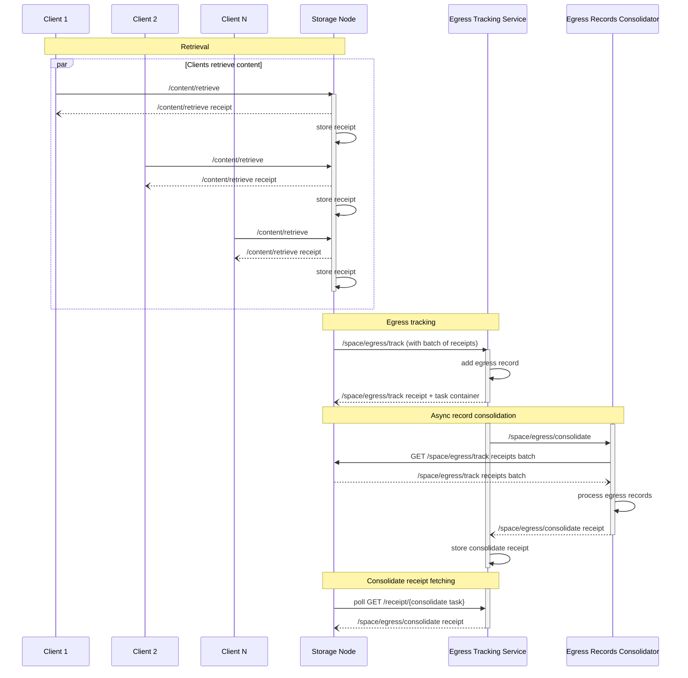

# Egress Tracking Protocol


## Authors

- [Vicente Olmedo](https://github.com/volmedo)

## Language

The key words "MUST", "MUST NOT", "REQUIRED", "SHALL", "SHALL NOT", "SHOULD", "SHOULD NOT", "RECOMMENDED", "MAY", and "OPTIONAL" in this document are to be interpreted as described in [RFC2119](https://datatracker.ietf.org/doc/html/rfc2119).

## Abstract

The egress tracking protocol allows storage nodes to add egress tracking records that will be used to account for the amount of data they serve. These records will then be used to calculate egress fees for the node.

The egress tracking protocol takes place as a result of the [retrieval][retrieval protocol] of blobs from storage nodes. Every time a client retrieves a blob from a storage node, the storage node issues a receipt for the retrieval. These receipts are collected by the storage node and used as proofs of retrievals to calculate egress fees.

# Introduction

## Concepts

### Roles

| Name                        | Description                                                                                        |
| --------------------------- | ----------------------------------------------------------------------------------------------------- |
| Client                      | A [principal] retrieving content from a storage node.                                              |
| Storage Node                | A [principal] that stores blob content, serves retrievals and requests tracking of the egress they generate. |
| Egress Tracking Service     | A service [principal] that records egress on behalf of storage nodes.                              |
| Egress Records Consolidator | A logical entity that processes egress records into a view used to calculate egress fees. It MAY be implemented by the egress tracking service itself. |

### Common Types

Schemas in this document are described using [IPLD Schema] notation, accompanied by equivalent Go types whose `cborgen` tags define the wire keys. Failure values follow the `{name, message}` convention of the [receipt] spec.

## Protocol Flow

The following diagram depicts the interactions between the different actors involved in the egress tracking protocol. Note that some of the interactions belong to the [retrieval protocol], but are included to highlight the relationship between retrieval and egress tracking.



Egress tracking enables authorized storage nodes to be paid egress fees for the content they serve. To do so, they MAY issue `/space/egress/track` invocations to an egress tracking service. These invocations contain [`/content/retrieve`][content retrieve] receipts as proof that content was served.

In order to make the most efficient use of resources and reduce overhead, storage nodes MUST batch receipts into a single `/space/egress/track` invocation. As they serve content, storage nodes store `/content/retrieve` receipts. Once they have collected a batch of them, they issue a `/space/egress/track` invocation to the egress tracking service. Receipt batches MUST have a minimum size of at least 10 MiB and a maximum size of 1 GiB. These limits ensure that egress can be recorded and processed efficiently and that the storage node can issue invocations at a reasonable rate.

Periodically, the egress tracking service invokes `/space/egress/consolidate` on the egress records consolidator. The result of this operation is stored in the corresponding receipts to keep a paper trail of the process. Storage nodes MAY fetch these receipts to confirm they match their own records.

# Capabilities

## Egress Track

A storage node MAY invoke the `/space/egress/track` capability on the egress tracking service subject to record the egress accounted for in a batch of [`/content/retrieve`][content retrieve] receipts.

### Egress Track Invocation

#### Egress Track Arguments Schema

```ipldsch
type TrackArguments struct {
  receipts Link   # content archive (CAR) containing the batch of receipts
  endpoint String # URL template the receipts batch can be fetched from
}
```

<details>
<summary>Go syntax</summary>

```go
type TrackArguments struct {
	Receipts cid.Cid `cborgen:"receipts"`
	Endpoint string  `cborgen:"endpoint"`
}
```

</details>

The `args.receipts` field MUST be the CID of a [content archive][CAR] containing a batch of [`/content/retrieve`][content retrieve] receipts, whose audience MUST be the issuer of the `/space/egress/track` invocation — a storage node MUST only request tracking of retrievals it fulfilled. To keep the invocation small the receipts are not attached to it: they are staged by the storage node and fetched at consolidation time.

The `args.endpoint` field MUST be a URL to an endpoint on the storage node that receipt batches can be fetched from. The endpoint MUST support HTTP `GET` requests and MUST contain a `{cid}` placeholder in the URL. During consolidation, the egress records consolidator fetches the receipts from the storage node using the URL provided, replacing the `{cid}` placeholder with the CID of the receipt batch.

For example, given the following arguments:

```json
{
  "receipts": { "/": "bag..receiptBatch" },
  "endpoint": "https://storage-node.example.com/receipts/{cid}"
}
```

the receipt batch will be fetched by sending an HTTP `GET` request to `https://storage-node.example.com/receipts/bag..receiptBatch`.

The receipts endpoint MAY support compression via the HTTP `Accept-Encoding` header to reduce the amount of data transferred and minimize egress.

#### Egress Track Invocation Example

The following example shows a `/space/egress/track` invocation sent by a storage node to an egress tracking service.

> ℹ️ Note: examples show the invocation payload; the enclosing signed envelope is elided. We use `// "/": "bafy.."` comments to denote the [task][UCAN task] link of the invocation.

```jsonc
{ // "/": "bafy..track"
  "iss": "did:key:zStorageNode",
  "aud": "did:web:egress.example.com",
  "sub": "did:web:egress.example.com",
  "cmd": "/space/egress/track",
  "args": {
    // content archive (CAR) containing the batch of receipts
    "receipts": { "/": "bag..receiptBatch" },
    // URL template the receipts batch can be fetched from
    "endpoint": "https://storage-node.example.com/receipts/{cid}"
  },
  "prf": [{ "/": "bafy..dlgEgressService" }],
  "nonce": { "/": { "bytes": "dHJhY2s" } },
  "exp": 1735689600
}
```

### Egress Track Receipt

After recording the egress tracking record, the egress tracking service MUST issue a receipt. The success value is an empty object.

#### Egress Track Receipt Schema

```ipldsch
type TrackResult union {
  | TrackOK "ok"
  | Error   "error"
} representation keyed

type TrackOK struct {}
```

<details>
<summary>Go syntax</summary>

```go
type TrackOK struct{}
```

</details>

#### Egress Track Promised Tasks

A successful invocation MUST return a response [container][UCAN container] carrying, in addition to the egress track receipt, the invocation of the [Egress Consolidate] task that will process the tracked records. Consolidation happens asynchronously — storage nodes MAY poll the egress tracking service's `/receipt/{task}` endpoint, as described in the blob protocol's [receipt retrieval] section, to fetch the consolidation receipt and check the result of the process.

## Egress Consolidate

The egress tracking service MAY invoke the `/space/egress/consolidate` capability on the egress records consolidator subject to process tracked egress records and consolidate them into a view that can be used to calculate egress fees.

To process egress records, the egress records consolidator fetches the receipts from the storage node using the URL provided in the [Egress Track] invocation. The data in these receipts, along with the original invocation, is used to create a view that can be used to calculate egress fees for the storage node.

### Egress Consolidate Invocation

#### Egress Consolidate Arguments Schema

```ipldsch
type ConsolidateArguments struct {
  cause Link # /space/egress/track task that originated this consolidation
}
```

<details>
<summary>Go syntax</summary>

```go
type ConsolidateArguments struct {
	Cause cid.Cid `cborgen:"cause"`
}
```

</details>

The `args.cause` field MUST be set to the [task][UCAN task] link of the [Egress Track] task that originated this consolidation.

#### Egress Consolidate Invocation Example

```jsonc
{ // "/": "bafy..consolidate"
  "iss": "did:web:egress.example.com",
  "aud": "did:web:consolidator.example.com",
  "sub": "did:web:consolidator.example.com",
  "cmd": "/space/egress/consolidate",
  "args": {
    // task that originated this consolidation
    "cause": { "/": "bafy..track" }
  },
  "prf": [{ "/": "bafy..dlgConsolidator" }],
  "nonce": { "/": { "bytes": "Y29uc29saWRhdGU" } },
  "exp": 1735689600
}
```

### Egress Consolidate Receipt

The consolidation task processes a batch of receipts. It is possible that some receipts, but not all, fail to be processed. In this case the task MUST return a success value containing a list of the errors that occurred during the processing of the receipts. If all receipts were processed successfully, the `errors` list MUST be empty.

This is different from a failure result, which signals an issue that prevents the batch from being processed at all.

Storage nodes MUST produce receipt batches that are between 10 MiB and 1 GiB in size. Batches that are too small or too large MUST be rejected at consolidation time with a failure receipt. If that's the case, the storage node will need to issue a new [Egress Track] invocation with a new, valid batch of receipts.

#### Egress Consolidate Receipt Schema

```ipldsch
type ConsolidateResult union {
  | ConsolidateOK "ok"
  | Error         "error"
} representation keyed

type ConsolidateOK struct {
  totalEgress Int # total bytes of egress accounted by the processed receipts
  errors      [ReceiptError]
}

type ReceiptError struct {
  name    String # machine readable error name
  message String # human readable description
  receipt Link   # the receipt that failed to be processed
}
```

<details>
<summary>Go syntax</summary>

```go
type ConsolidateOK struct {
	TotalEgress uint64         `cborgen:"totalEgress"`
	Errors      []ReceiptError `cborgen:"errors"`
}

type ReceiptError struct {
	Name    string  `cborgen:"name"`
	Message string  `cborgen:"message"`
	Receipt cid.Cid `cborgen:"receipt"`
}
```

</details>

#### Egress Consolidate Receipt Example

The following example shows that the consolidation process was successful and receipts processed successfully account for a total of 123,456,789 bytes of egress. However, a receipt in the batch failed to be processed:

```jsonc
{
  "iss": "did:web:consolidator.example.com",
  "aud": "did:web:consolidator.example.com",
  "sub": "did:web:consolidator.example.com",
  "cmd": "/ucan/assert/receipt",
  "args": {
    // the /space/egress/consolidate task this receipt is for
    "ran": { "/": "bafy..consolidate" },
    "out": {
      "ok": {
        "totalEgress": 123456789,
        "errors": [
          {
            "name": "SomeError",
            "message": "something bad happened!",
            "receipt": { "/": "bafy..receipt" }
          }
        ]
      }
    }
  },
  "iat": 1735689500
}
```

[retrieval protocol]:./retrieval.md
[content retrieve]:./retrieval.md#content-retrieve
[receipt retrieval]:./blob.md#add-blob-promised-tasks
[receipt]:./ucan.md#receipt
[Egress Track]:#egress-track
[Egress Consolidate]:#egress-consolidate
[principal]:https://github.com/ucan-wg/spec#principals
[IPLD Schema]:https://ipld.io/docs/schemas/
[CAR]:https://ipld.io/specs/transport/car/
[UCAN task]:https://github.com/ucan-wg/invocation#task
[UCAN container]:https://github.com/ucan-wg/container
