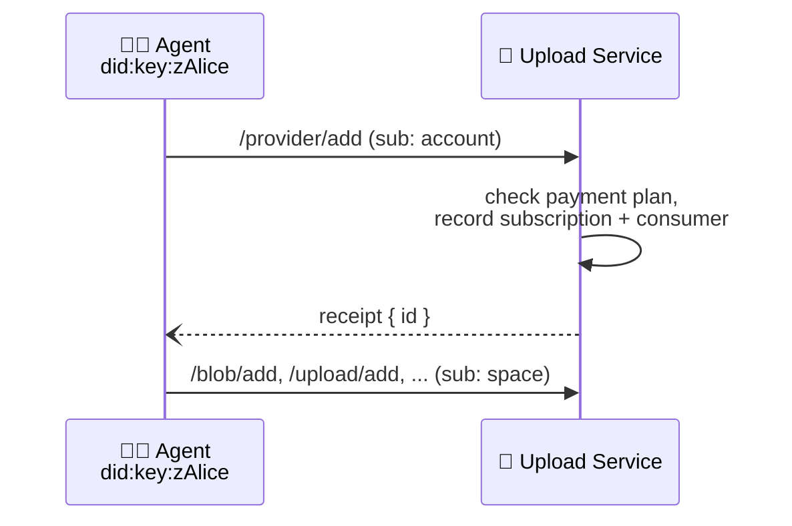

# Provider Protocol


## Authors

- [Irakli Gozalishvili](https://github.com/gozala)

## Editors

- [Alan Shaw](https://github.com/alanshaw)

## Abstract

The provider protocol allows accounts to provision spaces with a provider — a service that handles storage capabilities invoked on the space. A newly created space has no provider, so invocations that would store data in it fail until an account adds one.

## Language

The key words "MUST", "MUST NOT", "REQUIRED", "SHALL", "SHALL NOT", "SHOULD", "SHOULD NOT", "RECOMMENDED", "MAY", and "OPTIONAL" in this document are to be interpreted as described in [RFC2119](https://datatracker.ietf.org/doc/html/rfc2119).

# Introduction

A space is created locally by generating a keypair — no service is involved. Its owner has full authority to delegate capabilities on it, but holding a capability like `/upload/add` does not imply an invocation of it will succeed: something must _provide_ the capability. An account adds a provider to a space to make the storage capabilities invocable, and pays for the service it provides.

Because provisioning is decoupled from ownership, an account MAY provision any space — its own, or one it does not control, for example to sponsor a common goods space.

Payment is out of scope of this protocol. Accounts establish a payment plan with the service out-of-band — for example via a hosted billing provider — and the service checks for an active plan when a provider is added.

## Concepts

### Roles

| Name           | Description                                                                                 |
| -------------- | ------------------------------------------------------------------------------------------- |
| Agent          | A [principal] identified by [`did:key`] identifier, representing a user in an application.  |
| Account        | A [principal] identified by a [`did:mailto`] or [did:plc] identifier, that pays for the service provided to the spaces it provisions. |
| Upload Service | A service [principal] that offers providers and maintains the provisioning records.         |

### Space

A namespace, often referred as a "space", is an owned resource that can be shared. It corresponds to a unique asymmetric cryptographic keypair and is identified by a [`did:key`] URI.

Any valid [`did:key`] identifier represents a valid space, but a space has no provider by default: invocations that store data in an un-provisioned space fail _(error name `InsufficientStorage`)_.

### Provider

A provider is a service that handles the storage capabilities — such as [Add Blob] and [Add Upload] — invoked on spaces provisioned with it. A provider is identified by a [DID]. A service MAY offer one or more providers; typically the only provider offered by the upload service is itself.

### Subscription

A subscription records the relationship established by a successful [Add Provider] invocation: the account is the _customer_ paying for the service, the space is the _consumer_ receiving it, and the provider supplies it. The service retains the invocation that created the subscription as its cause — a signed record that the customer requested the service.

### Common Types

Schemas in this document are described using [IPLD Schema] notation, accompanied by equivalent Go types whose `cborgen` tags define the wire keys. Failure values follow the `{name, message}` convention of the [receipt] spec.

## Provisioning Flow



# Capabilities

## Add Provider

An authorized agent MAY invoke the `/provider/add` capability on the account subject to provision the space identified by `args.consumer` with the provider identified by `args.provider`.

The subject MUST be an account DID. For a [`did:mailto`] account, the invocation is issued by an agent holding an account delegation obtained via the [access protocol]. For a [did:plc] account — a tenant of the [S3 gateway][S3 Tenant Management] — the invocation MAY be self-issued: the issuer is the subject and no proofs are carried.

The account MUST have an active payment plan with the service. Payment plans are established out-of-band and are out of scope of this specification. A service MAY waive this requirement, for example in a test deployment.

The invocation does not require proof of ownership of the consumer space — the space keypair does not sign anything, and an account MAY provision a space it does not control.

> ⚠️ A space can be provisioned with a given provider at most once, by whichever account gets there first. Accounts SHOULD provision spaces they created themselves or were invited to pay for.

Once provisioned, storage capabilities invoked on the space subject — such as [Add Blob] and [Add Upload] — can succeed. Invocations on an un-provisioned space fail _(error name `InsufficientStorage`)_.

### Add Provider Invocation

#### Add Provider Arguments Schema

```ipldsch
type AddArguments struct {
  provider String # DID of the provider to add to the space
  consumer String # DID of the space to provision with the provider
}
```

<details>
<summary>Go syntax</summary>

```go
type AddArguments struct {
	Provider did.DID `cborgen:"provider"`
	Consumer did.DID `cborgen:"consumer"`
}
```

</details>

The `args.provider` field MUST be set to the [DID] of the provider to add. It MUST be a provider offered by the service — typically the upload service's own DID.

The `args.consumer` field MUST be set to the [`did:key`] identifier of the space to provision.

#### Add Provider Invocation Example

> ℹ️ Note: examples show the invocation payload; the enclosing signed envelope is elided. We use `// "/": "bafy.."` comments to denote the [task][UCAN task] link of the invocation.

An agent provisioning a space on behalf of a [`did:mailto`] account, using an account delegation obtained via the [access protocol]:

```jsonc
{ // "/": "bafy..providerAdd"
  "iss": "did:key:zAlice",
  "aud": "did:web:upload.example.com",
  "sub": "did:mailto:web.mail:alice",
  "cmd": "/provider/add",
  "args": {
    // DID of the provider to add to the space
    "provider": "did:web:upload.example.com",
    // DID of the space to provision with the provider
    "consumer": "did:key:zAliceSpace"
  },
  "prf": [{ "/": "bafy..dlgAliceAccount" }],
  "nonce": { "/": { "bytes": "cHJvdmlkZXI" } },
  "exp": 1735689600
}
```

A [did:plc] tenant provisioning a bucket space with a self-issued invocation:

```jsonc
{ // "/": "bafy..providerAddTenant"
  "iss": "did:plc:tenant",
  "aud": "did:web:upload.example.com",
  "sub": "did:plc:tenant",
  "cmd": "/provider/add",
  "args": {
    // DID of the provider to add to the space
    "provider": "did:web:upload.example.com",
    // DID of the bucket space to provision with the provider
    "consumer": "did:key:zBucket"
  },
  "nonce": { "/": { "bytes": "cHJvdmlkZXI" } },
  "exp": 1735689600
}
```

### Add Provider Receipt

Invocation MUST fail if any of the following is true:

1. The subject of the invocation is not a valid account DID _(error name `InvalidAccount`)_.
1. The account does not have an active payment plan, and the service has not waived the requirement _(error name `AccountPlanMissing`)_.
1. The requested provider is not offered by the service _(error name `ProviderNotAllowed`)_.
1. The space is already provisioned with the provider _(error name `ConsumerExists`)_. This applies regardless of which account provisioned it — including a repeat invocation by the same account.

Invocation MUST succeed otherwise. The `out.ok.id` field MUST be set to the identifier of the subscription binding the consumer space to the provider.

> ℹ️ Note: the upload service derives the subscription identifier deterministically from the space DID — the string form of a CIDv1 with the DAG-CBOR codec over the encoded map `{ "consumer": <space DID> }` — so a given space always maps to the same subscription.

#### Add Provider Receipt Schema

```ipldsch
type AddResult union {
  | AddOK "ok"
  | Error "error"
} representation keyed

type AddOK struct {
  id String # identifier of the subscription
}
```

<details>
<summary>Go syntax</summary>

```go
type AddOK struct {
	ID string `cborgen:"id"`
}
```

</details>

#### Add Provider Receipt Example

```jsonc
{
  "iss": "did:web:upload.example.com",
  "aud": "did:web:upload.example.com",
  "sub": "did:web:upload.example.com",
  "cmd": "/ucan/assert/receipt",
  "args": {
    // refers to the invocation from the example
    "ran": { "/": "bafy..providerAdd" },
    "out": {
      "ok": {
        // identifier of the subscription
        "id": "bafyr..subscription"
      }
    }
  },
  "iat": 1735689500
}
```

[Add Provider]:#add-provider
[Add Blob]:./blob.md#add-blob
[Add Upload]:./upload.md#add-upload
[access protocol]:./access.md
[S3 Tenant Management]:./s3.md
[receipt]:./ucan.md#receipt
[`did:mailto`]:./did-mailto.md
[`did:key`]:https://w3c-ccg.github.io/did-key-spec/
[did:plc]:https://web.plc.directory/spec/v0.1/did-plc
[DID]:https://www.w3.org/TR/did-core/
[principal]:https://github.com/ucan-wg/spec#principals
[UCAN task]:https://github.com/ucan-wg/invocation#task
[IPLD Schema]:https://ipld.io/docs/schemas/
