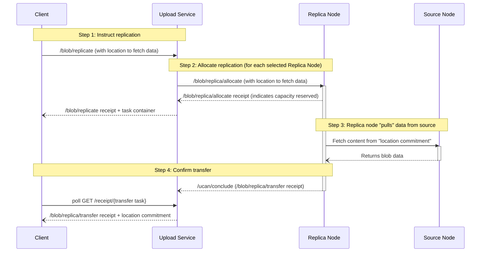

# Replication Protocol


## Authors

- [Alan Shaw](https://github.com/alanshaw), [Storacha Network](https://storacha.network/)

## Language

The key words "MUST", "MUST NOT", "REQUIRED", "SHALL", "SHALL NOT", "SHOULD", "SHOULD NOT", "RECOMMENDED", "MAY", and "OPTIONAL" in this document are to be interpreted as described in [RFC2119](https://datatracker.ietf.org/doc/html/rfc2119).

## Introduction

The replication protocol enables distributed storage of blobs across multiple nodes in the network. This specification extends the [blob protocol] by defining how nodes replicate data after initial upload. The protocol establishes the following roles:

- The **Client** instructs replications.
- The **Upload Service** receives replication instructions and orchestrates replications.
- **Storage Nodes** store blob data.
- A **Source Node** is a _Storage Node_ which already stores the blob, selected by the _Upload Service_.
- **Replica Nodes** are _Storage Nodes_ which do not yet store the blob, selected by the _Upload Service_ to each store an additional copy.

This allows the network to maintain multiple copies of each blob, distributed across different nodes.

Note that a _Replica Node_ in one replication operation may later be selected as the _Source Node_ for another operation, as it will then hold a copy of the blob.

Out of scope: This specification does not propose any solution for repairing lost data from any node.

### Common Types

Schemas in this document are described using [IPLD Schema] notation, accompanied by equivalent Go types whose `cborgen` tags define the wire keys. The following types are shared by several capabilities:

```ipldsch
# A promise resolving to the success branch of another task's result,
# encoded as a single entry map keyed by "await/ok".
type AwaitOK struct {
  task Link (rename "await/ok") # task whose result resolves this promise
}

type Blob struct {
  digest Bytes # multihash digest of the blob payload
  size   Int   # number of bytes in the blob
}

# Convention for failure values, see the receipt spec.
type Error struct {
  name    String # machine readable error name
  message String # human readable description
}
```

<details>
<summary>Go syntax</summary>

```go
// AwaitOK marshals as {"await/ok": Task}.
type AwaitOK struct {
	Task cid.Cid
}

type Blob struct {
	Digest multihash.Multihash `cborgen:"digest"`
	Size   uint64              `cborgen:"size"`
}

type Error struct {
	Name    string `cborgen:"name"`
	Message string `cborgen:"message"`
}
```

</details>

## Diagram

The interactions can be summarized by the following diagram:



# Capabilities

## Replicate Blob

An authorized agent MAY invoke the `/blob/replicate` capability on the [space] subject to instruct the upload service to replicate a blob to enough _Replica Nodes_ to bring the total number of _Storage Nodes_ storing that blob to the given `replicas` number.

A replication request can only be issued after some _Storage Node_ has successfully stored the blob, and the invocation must point to a `site` where it is known to exist. This can be found in the receipt of the original [Accept Blob] task (for the original location), as well as any [Transfer Replica] receipts from prior replications (for the additional replica locations).

Typically, for a given blob, `/blob/replicate` is issued once, by the client which originally issued [Add Blob] to store the blob, after the consequent [Accept Blob] task is complete.

### Replicate Blob Invocation

#### Replicate Blob Arguments Schema

```ipldsch
type ReplicateArguments struct {
  blob     Blob # blob to replicate
  replicas Int  # total number of copies to ensure exist in the network
  site     Link # location commitment indicating where the blob must be fetched from
}
```

<details>
<summary>Go syntax</summary>

```go
type ReplicateArguments struct {
	Blob     Blob    `cborgen:"blob"`
	Replicas uint64  `cborgen:"replicas"`
	Site     cid.Cid `cborgen:"site"`
}
```

</details>

The `args.blob` field MUST be set to the `Blob` that is to be replicated.

The `args.replicas` field MUST be an unsigned integer greater than 0 indicating the total number of copies the network should ensure are stored. For instance, if a blob has not yet been explicitly replicated, it exists on 1 node, and invoking `/blob/replicate` with `"replicas": 3` adds 2 additional replicas to the network. The invocation is idempotent: asking for `"replicas": 3` again does nothing, leaving the total number of copies at 3.

It is RECOMMENDED that the upload service mandate a minimum _and_ a maximum value for `replicas`. The minimum and maximum MAY be the same.

The `args.site` field MUST be a link to the [location commitment] describing where the blob can be retrieved. The committed location must be storing the blob on behalf of the same space. New replica locations MUST fetch the blob from this site. It is RECOMMENDED that the location commitment invocation is transmitted in the request [container][UCAN container].

#### Replicate Blob Invocation Example

> ℹ️ Note: examples show the invocation payload; the enclosing signed envelope is elided. We use `// "/": "bafy.."` comments to denote the [task][UCAN task] link of the invocation, except where noted otherwise.

```jsonc
{ // "/": "bafy..replicate"
  "iss": "did:key:zAlice",
  "aud": "did:web:upload.example.com",
  "sub": "did:key:zAliceSpace",
  "cmd": "/blob/replicate",
  "args": {
    "blob": {
      // multihash of the blob as byte array
      "digest": { "/": { "bytes": "mEi...sfKg" } },
      // size of the blob in bytes
      "size": 2097152
    },
    // total number of replicas to ensure
    "replicas": 3,
    // location commitment indicating where the blob must be fetched from
    "site": { "/": "bafy..site" }
  },
  "prf": [{ "/": "bafy..dlgAliceSpace" }],
  "nonce": { "/": { "bytes": "cmVwbGljYXRl" } },
  "exp": 1735689600
}
```

### Replicate Blob Receipt

Invocation MUST fail if any of the following is true:

1. Provided subject space does not currently store the blob _(error name `ReplicationSourceNotFound`)_.
1. Provided `blob.size` is outside of supported range.
1. Provided `blob.digest` is not a valid [multihash].
1. Provided `blob.digest` [multihash] hashing algorithm is not supported.
1. Provided `replicas` is not an unsigned integer greater than 0, or is outside of any configured minimum or maximum value set by the upload service _(error name `ReplicationCountRangeError`)_.
1. Provided `site` is an invalid or revoked [location commitment] _(error name `InvalidReplicationSite`)_.
1. The upload service is unable to successfully select and allocate enough _Replica Nodes_.

The invocation MUST succeed if none of the above are true. The success value MUST be an object with a `site` field set to a list of [await][promise]s on the results of the [Transfer Replica] tasks that produce [location commitment]s — one for each new replica created.

Behavior when the `replicas` value is _less_ than the current number of copies is undefined by this specification, but expected to be defined in the future.

#### Replicate Blob Receipt Schema

```ipldsch
type ReplicateResult union {
  | ReplicateOK "ok"
  | Error       "error"
} representation keyed

type ReplicateOK struct {
  site [AwaitOK] # promises of the /blob/replica/transfer task results
}
```

<details>
<summary>Go syntax</summary>

```go
type ReplicateOK struct {
	Site []AwaitOK `cborgen:"site"`
}
```

</details>

#### Replicate Blob Receipt Example

```jsonc
{
  "iss": "did:web:upload.example.com",
  "aud": "did:web:upload.example.com",
  "sub": "did:web:upload.example.com",
  "cmd": "/ucan/assert/receipt",
  "args": {
    // the /blob/replicate task this receipt is for
    "ran": { "/": "bafy..replicate" },
    "out": {
      "ok": {
        // resolve to location commitments for the new replicas
        "site": [
          { "await/ok": { "/": "bafy..transfer1" } },
          { "await/ok": { "/": "bafy..transfer2" } }
        ]
      }
    }
  },
  "iat": 1735689500
}
```

#### Replicate Blob Promised Tasks

The tasks awaited by `site` MUST be present in the response [container][UCAN container].

A successful invocation MUST return a response container carrying, in addition to the replicate blob receipt, the invocations of an [Allocate Replica] and a [Transfer Replica] task for each new replica, along with the receipts of the [Allocate Replica] tasks. The number of [Transfer Replica] tasks equals the number of new replicas created, which is the `replicas` value minus the number of existing copies.

The upload service MUST select the _Storage Nodes_ which will serve as _Replica Nodes_ and invoke [Allocate Replica] on each of them when it receives the `/blob/replicate` invocation. The set of _Replica Nodes_ MUST NOT include the _Source Node_. It SHOULD NOT include any _Storage Node_ which already stores the blob on behalf of the space, as the replication to that node will fail. It SHOULD NOT include any _Storage Node_ which has previously failed to replicate the blob, as the replication to that node is likely to fail.

Receipts for [Transfer Replica] tasks MAY be retrieved from the upload service by polling the `/receipt/{task}` endpoint, as described in the [blob protocol][receipt retrieval].

## Allocate Replica

The upload service MAY invoke the `/blob/replica/allocate` capability on a _Replica Node_ subject to reserve capacity for a replica of a blob.

The storage node is the subject of this capability: a storage node delegates it to the upload service when it joins the network.

### Allocate Replica Invocation

#### Allocate Replica Arguments Schema

```ipldsch
type AllocateArguments struct {
  blob  Blob # blob to allocate capacity for
  site  Link # location commitment indicating where the blob must be fetched from
  cause Link # /blob/replicate task that caused this allocation
}
```

<details>
<summary>Go syntax</summary>

```go
type AllocateArguments struct {
	Blob  Blob    `cborgen:"blob"`
	Site  cid.Cid `cborgen:"site"`
	Cause cid.Cid `cborgen:"cause"`
}
```

</details>

The `args.blob` field MUST be set to the `Blob` a replica is allocated for.

The `args.site` field MUST be a link to the [location commitment] describing where the blob can be retrieved from.

The `args.cause` field MUST be set to the [task][UCAN task] link of the [Replicate Blob] task that caused the allocation. The space the replica is stored on behalf of is the subject of the linked task. The linked invocation SHOULD be transmitted in the request [container][UCAN container].

#### Allocate Replica Invocation Example

```jsonc
{ // "/": "bafy..rAlloc"
  "iss": "did:web:upload.example.com",
  "aud": "did:key:zReplicaNode",
  "sub": "did:key:zReplicaNode",
  "cmd": "/blob/replica/allocate",
  "args": {
    "blob": {
      // multihash of the blob as byte array
      "digest": { "/": { "bytes": "mEi...sfKg" } },
      "size": 2097152
    },
    // location commitment indicating where the blob must be fetched from
    "site": { "/": "bafy..site" },
    // task that caused this invocation
    "cause": { "/": "bafy..replicate" }
  },
  "prf": [{ "/": "bafy..dlgReplicaNode" }],
  "nonce": { "/": { "bytes": "YWxsb2NhdGU" } },
  "exp": 1735689600
}
```

### Allocate Replica Receipt

Invocation MUST fail if any of the following is true:

1. Provided `blob.size` is outside of supported range.
1. Provided `blob.digest` is not a valid [multihash].
1. Provided `blob.digest` [multihash] hashing algorithm is not supported.
1. Provided `site` is an invalid or revoked [location commitment] _(error name `InvalidReplicationSite`)_.

Invocation MUST succeed if none of the above are true. The success value MUST be an object with a `site` field set to an [await][promise] on the result of the [Transfer Replica] task the _Replica Node_ will perform. The [Transfer Replica] invocation MUST be transmitted in the [container][UCAN container] alongside the allocate replica receipt.

#### Allocate Replica Receipt Schema

```ipldsch
type AllocateResult union {
  | AllocateOK "ok"
  | Error      "error"
} representation keyed

type AllocateOK struct {
  site AwaitOK # promise of the /blob/replica/transfer task result
}
```

<details>
<summary>Go syntax</summary>

```go
type AllocateOK struct {
	Site AwaitOK `cborgen:"site"`
}
```

</details>

## Transfer Replica

The `/blob/replica/transfer` task is performed by each _Replica Node_. The blob is transferred from the location specified in the [location commitment] referenced by the [Allocate Replica] invocation.

Like the [Put Blob] task of the [blob protocol], the invocation is a placeholder for work the _Replica Node_ performs asynchronously: the _Replica Node_ is the issuer, audience and subject, and the receipt is issued once the transfer completes.

### Transfer Replica Invocation

#### Transfer Replica Arguments Schema

```ipldsch
type TransferArguments struct {
  blob  Blob # blob to transfer
  site  Link # location commitment indicating where the blob must be fetched from
  cause Link # /blob/replica/allocate task that initiated this transfer
}
```

<details>
<summary>Go syntax</summary>

```go
type TransferArguments struct {
	Blob  Blob    `cborgen:"blob"`
	Site  cid.Cid `cborgen:"site"`
	Cause cid.Cid `cborgen:"cause"`
}
```

</details>

The `args.blob` field MUST be set to the `Blob` being transferred.

The `args.site` field MUST be a link to the [location commitment] describing where the blob will be transferred from.

The `args.cause` field MUST be set to the [task][UCAN task] link of the [Allocate Replica] task that initiated the transfer.

#### Transfer Replica Invocation Example

```jsonc
{ // "/": "bafy..transfer1"
  "iss": "did:key:zReplicaNode",
  "aud": "did:key:zReplicaNode",
  "sub": "did:key:zReplicaNode",
  "cmd": "/blob/replica/transfer",
  "args": {
    "blob": {
      // multihash of the blob as byte array
      "digest": { "/": { "bytes": "mEi...sfKg" } },
      "size": 2097152
    },
    // location the blob will be transferred from
    "site": { "/": "bafy..site" },
    // task that initiated this transfer
    "cause": { "/": "bafy..rAlloc" }
  },
  "prf": [],
  "nonce": { "/": { "bytes": "dHJhbnNmZXI" } },
  "exp": 1735689600
}
```

### Transfer Replica Receipt

The receipt MUST be issued by the _Replica Node_ once the transfer is complete. The _Replica Node_ MUST communicate the receipt back to the upload service using the [UCAN conclusion] capability.

Invocation MUST fail if any of the following is true:

1. Provided `blob.size` is outside of supported range.
1. Provided `blob.digest` is not a valid [multihash].
1. Provided `blob.digest` [multihash] hashing algorithm is not supported.
1. Provided `site` is an invalid or revoked [location commitment] _(error name `InvalidReplicationSite`)_.

Invocation MUST succeed if none of the above are true. The success value MUST include a `site` field set to the link of a new [location commitment] invocation, signed by the _Replica Node_, committing to the blob's new location. The location commitment invocation MUST be transmitted in the [container][UCAN container] alongside the transfer replica receipt.

The success value MUST also include a `pdp` field set to an [await][promise] on the result of a [`/pdp/accept`][PDP accept] task, which completes when the replica has been aggregated into the _Replica Node_'s proof of data possession dataset.

The transfer MAY fail for other reasons — for example, the _Source Node_ is unreachable. When a transfer fails, it is up to the client to re-instruct replication by issuing another [Replicate Blob] invocation with a new `nonce`. The response container for that invocation MUST include the tasks for existing non-failed replications along with any new replication tasks.

#### Transfer Replica Receipt Schema

```ipldsch
type TransferResult union {
  | TransferOK "ok"
  | Error      "error"
} representation keyed

type TransferOK struct {
  site Link    # link to the new /assert/location invocation
  pdp  AwaitOK # promise of the /pdp/accept task result
}
```

<details>
<summary>Go syntax</summary>

```go
type TransferOK struct {
	Site cid.Cid `cborgen:"site"`
	PDP  AwaitOK `cborgen:"pdp"`
}
```

</details>

#### Transfer Replica Receipt Example

```jsonc
{
  "iss": "did:key:zReplicaNode",
  "aud": "did:key:zReplicaNode",
  "sub": "did:key:zReplicaNode",
  "cmd": "/ucan/assert/receipt",
  "args": {
    // the /blob/replica/transfer task this receipt is for
    "ran": { "/": "bafy..transfer1" },
    "out": {
      "ok": {
        // link to the new location commitment invocation
        "site": { "/": "bafy..newSite" },
        // resolves when the replica enters the node's PDP dataset
        "pdp": { "await/ok": { "/": "bafy..pdp" } }
      }
    }
  },
  "iat": 1735689500
}
```

[blob protocol]:./blob.md
[space]:./blob.md#space
[location commitment]:./blob.md#location-commitment
[Add Blob]:./blob.md#add-blob
[Accept Blob]:./blob.md#accept-blob
[Put Blob]:./blob.md#put-blob
[receipt retrieval]:./blob.md#add-blob-promised-tasks
[Replicate Blob]:#replicate-blob
[Allocate Replica]:#allocate-replica
[Transfer Replica]:#transfer-replica
[UCAN conclusion]:./ucan.md#conclusion
[PDP accept]:./pdp.md#pdp-accept
[multihash]:https://github.com/multiformats/multihash
[IPLD Schema]:https://ipld.io/docs/schemas/
[UCAN task]:https://github.com/ucan-wg/invocation#task
[UCAN container]:https://github.com/ucan-wg/container
[promise]:https://github.com/ucan-wg/promise
