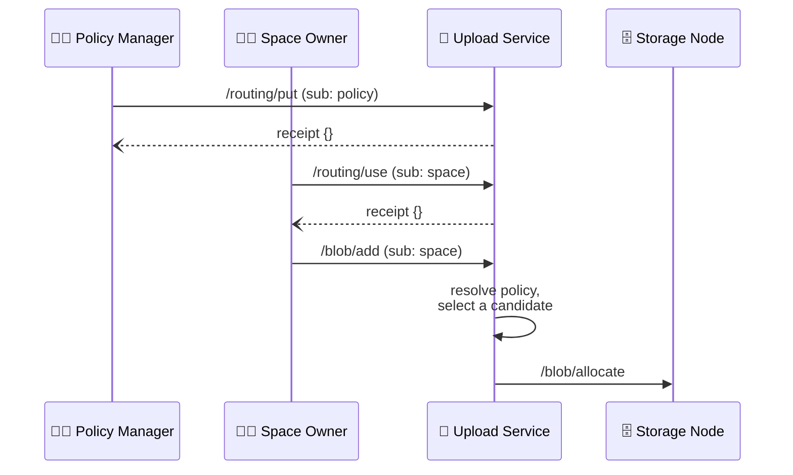

# Routing Protocol


## Authors

- [Alan Shaw](https://github.com/alanshaw)

## Abstract

The routing protocol constrains which storage nodes the upload service may allocate a space's blobs on. A routing policy is a shared, DID-identified set of candidate storage nodes; a space that references a policy has every blob write routed to one of the policy's candidates, whichever agent issued the write.

## Language

The key words "MUST", "MUST NOT", "REQUIRED", "SHALL", "SHALL NOT", "SHOULD", "SHOULD NOT", "RECOMMENDED", "MAY", and "OPTIONAL" in this document are to be interpreted as described in [RFC2119](https://datatracker.ietf.org/doc/html/rfc2119).

# Introduction

When an agent invokes [Add Blob] on a space, the upload service selects a storage node to allocate the blob on. By default the selection is made from every registered storage node, so a space's data lands wherever the service chooses.

Some deployments need a stronger property: every blob written to a space stays on a known set of nodes, for example the nodes operated by the region's provider. The constraint has to hold for every write to the space, including writes from agents that know nothing about storage nodes, so it must be an attribute of the space enforced by the upload service rather than something each writer supplies.

Storing a node list on every space would repeat the same list across every space in a region, and changing the region's nodes would mean updating every one of them. The routing protocol instead makes the node list a first-class entity, a _routing policy_, that spaces reference by DID. Changing a region's storage nodes is one update to the policy, effective for every space that references it.

## Concepts

### Roles

| Name           | Description                                                                                                   |
| -------------- | ------------------------------------------------------------------------------------------------------------- |
| Agent          | A [principal] identified by a [DID], authorized to manage a routing policy or a space's policy reference.    |
| Upload Service | A service [principal] that stores routing policies and applies them when allocating blobs.                   |
| Storage Node   | A [principal] registered with the upload service that stores blob content.                                    |

### Space

A namespace, often referred to as a "space", is an owned resource that can be shared. It corresponds to a unique asymmetric cryptographic keypair and is identified by a [`did:key`] URI. See the [blob protocol][space] for the full definition.

### Routing Policy

A routing policy is an entity identified by a DID that owns a set of storage node DIDs, its _candidates_. It is a routing constraint for the spaces that reference it. It is not a request that a particular node be selected unless the set holds a single DID.

A routing policy MUST be a cryptographic keypair identified by a [`did:key`] URI, following the same pattern as a space. Authority over the policy is rooted in its key. After creating the policy, its key SHOULD issue a non-expiring delegation of `/` to the principal that will manage it, after which the private key MAY be discarded.

A policy requires no registration step. It exists in the upload service once its first [Put Routing Policy] invocation succeeds.

### Policy Reference

A policy reference is the association from a space to a routing policy, stored by the upload service as an attribute of the space. A space has at most one policy reference. A space with no reference uses the upload service's default routing.

### Candidate

A candidate is a storage node named in a routing policy. Every candidate MUST be a storage node registered with the upload service. A candidate carries a value reserved for per-node properties that influence routing decisions, such as weight; no properties are defined yet.

### Common Types

Schemas in this document are described using [IPLD Schema] notation, accompanied by equivalent Go types whose `cborgen` tags define the wire keys. Failure values follow the `{name, message}` convention of the [receipt] spec.

```ipldsch
# Per-node properties of a candidate. Empty; reserved for properties that
# influence routing decisions (e.g. weight).
type Candidate struct {}

# The candidate set of a routing policy, keyed by storage node DID. Map keys
# are sorted lexicographically; the map is a set, not a preference order.
type CandidateSet { DID: Candidate }

type DID string
```

<details>
<summary>Go syntax</summary>

```go
type Candidate struct{}

// CandidateSet encodes on the wire as the bare map.
type CandidateSet struct {
	Entries map[did.DID]Candidate
}
```

</details>

## Routing Flow



# Capabilities

## Put Routing Policy

An authorized agent MAY invoke the `/routing/put` capability on a routing policy subject to replace the policy's candidate set. The first successful invocation creates the policy.

The subject MUST be a routing policy DID. The invocation is issued by the policy key itself, or by an agent holding a delegation chain rooted at the policy key.

A change to a policy's candidates applies to invocations routed after the change takes effect. In-flight writes MAY be routed using the previous set.

### Put Routing Policy Invocation

#### Put Routing Policy Arguments Schema

```ipldsch
type PutArguments struct {
  candidates CandidateSet # storage nodes writes may be routed to
}
```

<details>
<summary>Go syntax</summary>

```go
type PutArguments struct {
	Candidates CandidateSet `cborgen:"candidates"`
}
```

</details>

The `args.candidates` field MUST contain one or more entries. Every key MUST be the [DID] of a storage node registered with the upload service. The value of each entry MUST be an empty map.

#### Put Routing Policy Invocation Example

> ℹ️ Note: examples show the invocation payload; the enclosing signed envelope is elided. We use `// "/": "bafy.."` comments to denote the [task][UCAN task] link of the invocation.

A policy manager holding the policy's root delegation replaces the candidate set:

```jsonc
{ // "/": "bafy..routingPut"
  "iss": "did:web:hilt.example.com",
  "aud": "did:web:upload.example.com",
  "sub": "did:key:zPolicy",
  "cmd": "/routing/put",
  "args": {
    // storage nodes writes may be routed to
    "candidates": {
      "did:key:zNode1": {},
      "did:key:zNode2": {}
    }
  },
  "prf": [{ "/": "bafy..dlgPolicyManager" }],
  "nonce": { "/": { "bytes": "cm91dGluZw" } },
  "exp": 1735689600
}
```

### Put Routing Policy Receipt

Invocation MUST fail if any of the following is true:

1. The candidate set is empty _(error name `InvalidCandidates`)_.
1. A candidate does not identify a storage node registered with the upload service _(error name `InvalidCandidates`)_.

Invocation MUST succeed otherwise. The success value is an empty map.

#### Put Routing Policy Receipt Schema

```ipldsch
type PutResult union {
  | PutOK "ok"
  | Error "error"
} representation keyed

type PutOK struct {}
```

<details>
<summary>Go syntax</summary>

```go
type PutOK struct{}
```

</details>

#### Put Routing Policy Receipt Example

```jsonc
{
  "iss": "did:web:upload.example.com",
  "aud": "did:web:upload.example.com",
  "sub": "did:web:upload.example.com",
  "cmd": "/ucan/assert/receipt",
  "args": {
    // refers to the invocation from the example
    "ran": { "/": "bafy..routingPut" },
    "out": {
      "ok": {}
    }
  },
  "iat": 1735689500
}
```

## Use Routing Policy

An authorized agent MAY invoke the `/routing/use` capability on a space subject to set or clear the space's policy reference.

The subject MUST be a space DID. The invocation is issued by the space key itself, or by an agent holding a delegation chain rooted at the space key.

Once a reference is set, every [Add Blob] invocation on the space is routed as described in [Routing]. Clearing the reference returns the space to the upload service's default routing.

### Use Routing Policy Invocation

#### Use Routing Policy Arguments Schema

```ipldsch
type UseArguments struct {
  policy optional DID # DID of the routing policy the space uses
}
```

<details>
<summary>Go syntax</summary>

```go
type UseArguments struct {
	Policy *did.DID `cborgen:"policy,omitempty"`
}
```

</details>

When present, the `args.policy` field MUST be set to the [DID] of a routing policy known to the upload service, one with a stored candidate set. When absent, the space's policy reference is cleared.

#### Use Routing Policy Invocation Example

A tenant of the [S3 gateway][S3 Tenant Management] points a bucket space at its region's policy, proven by the bucket's root delegation:

```jsonc
{ // "/": "bafy..routingUse"
  "iss": "did:plc:tenant",
  "aud": "did:web:upload.example.com",
  "sub": "did:key:zBucket",
  "cmd": "/routing/use",
  "args": {
    // DID of the routing policy the space uses
    "policy": "did:key:zPolicy"
  },
  "prf": [{ "/": "bafy..dlgBucketTenant" }],
  "nonce": { "/": { "bytes": "cm91dGluZw" } },
  "exp": 1735689600
}
```

Clearing the reference carries no arguments:

```jsonc
{ // "/": "bafy..routingClear"
  "iss": "did:plc:tenant",
  "aud": "did:web:upload.example.com",
  "sub": "did:key:zBucket",
  "cmd": "/routing/use",
  "args": {},
  "prf": [{ "/": "bafy..dlgBucketTenant" }],
  "nonce": { "/": { "bytes": "cm91dGluZw" } },
  "exp": 1735689600
}
```

### Use Routing Policy Receipt

Invocation MUST fail if any of the following is true:

1. The subject space is not provisioned with a provider _(error name `SpaceNotProvisioned`)_. See the [provider protocol].
1. `args.policy` is present and does not identify a routing policy with a stored candidate set _(error name `UnknownPolicy`)_.

Invocation MUST succeed otherwise. The success value is an empty map.

#### Use Routing Policy Receipt Schema

```ipldsch
type UseResult union {
  | UseOK "ok"
  | Error "error"
} representation keyed

type UseOK struct {}
```

<details>
<summary>Go syntax</summary>

```go
type UseOK struct{}
```

</details>

#### Use Routing Policy Receipt Example

```jsonc
{
  "iss": "did:web:upload.example.com",
  "aud": "did:web:upload.example.com",
  "sub": "did:web:upload.example.com",
  "cmd": "/ucan/assert/receipt",
  "args": {
    // refers to the invocation from the example
    "ran": { "/": "bafy..routingUse" },
    "out": {
      "ok": {}
    }
  },
  "iat": 1735689500
}
```

# Routing

For an [Add Blob] invocation on a space with a policy reference, the upload service MUST resolve the referenced policy and select a storage node from its candidates. The upload service MUST NOT route the invocation to a storage node outside the candidate set, and MUST fail the invocation rather than fall back to another node when no candidate can serve it _(error name `CandidateUnavailable`)_.

The upload service MAY use any of its normal routing considerations to choose among the candidates, including availability, capacity, and weight.

An [Add Blob] invocation on a space with no policy reference is routed as if this protocol did not exist.

## Replication

How a policy applies to replica placement under the [replication protocol] is undefined. A future revision MAY specify it.

[Put Routing Policy]:#put-routing-policy
[Use Routing Policy]:#use-routing-policy
[Routing]:#routing
[Add Blob]:./blob.md#add-blob
[space]:./blob.md#space
[provider protocol]:./provider.md
[replication protocol]:./replication.md
[S3 Tenant Management]:./s3.md
[receipt]:./ucan.md#receipt
[`did:key`]:https://w3c-ccg.github.io/did-key-spec/
[DID]:https://www.w3.org/TR/did-core/
[principal]:https://github.com/ucan-wg/spec#principals
[UCAN task]:https://github.com/ucan-wg/invocation#task
[IPLD Schema]:https://ipld.io/docs/schemas/
